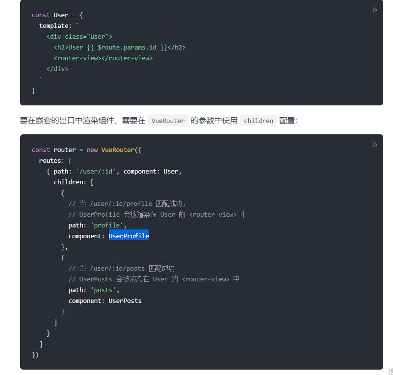
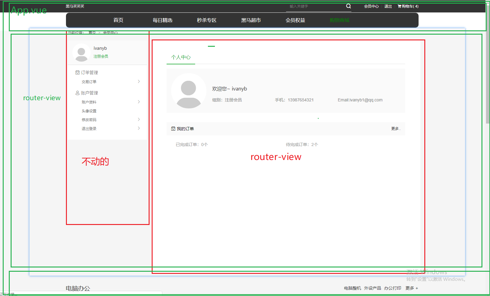
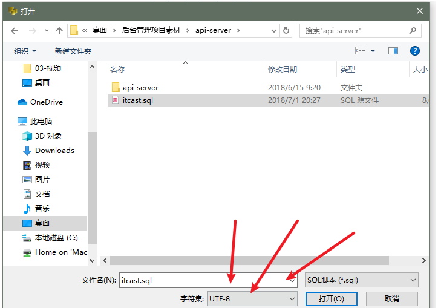
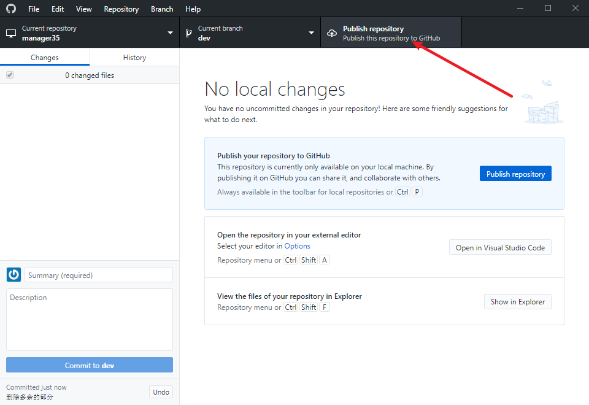
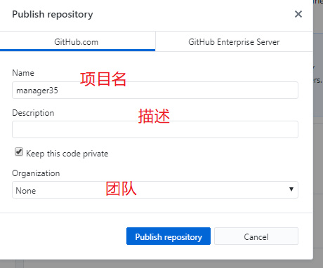

# Vue.js - day10

## router-嵌套路由

[传送门]<https://router.vuejs.org/zh/guide/essentials/nested-routes.html>



1. 在需要嵌套路由的组件里的合适地方写 `<router-view></router-view>`
2. 在路由规则里，找到这个组件的规则，加一个 `children` ，这也是一个数组，数组中每个元素也是个对象
3. 对象里有path,component和redirect等属性，跟普通路由规则的写法一样，只不过路径可以不用加/，如果加/，就代表根目录，意思就是访问这些子路由，直接就在网址后面写它的路径


## 黑买-嵌套路由整合



1. 04.user.vue 右侧用router-view替换
2. main.js中添加路由规则
   1. path:/user
      1. children:
         1. path:"xxx",
         2. component:组件
3. 重定向的用法 和之前类似，需要注意 /不需要在写即可

## vue-router 统一的错误页

[传送门](https://router.vuejs.org/zh/guide/essentials/dynamic-matching.html#%E6%8D%95%E8%8E%B7%E6%89%80%E6%9C%89%E8%B7%AF%E7%94%B1%E6%88%96-404-not-found-%E8%B7%AF%E7%94%B1)

1. main.js中 增加一个 兜底的规则 ，必须写最下面
   1. 新建一个notfound 找一个图片作为替代                                                                                                                                                                                                                                                                                                                                                                                                                                                                                                                                                                                                                                                                                                                                                                                                                                                                                                                                                                                                                                                                                                                                                                                                                                                                                                                                                                                                                                                                                                                                                                                                                                                                                                                                                                                                                                                                                                                                                                                                                                                                                                                                                                                                                                                                                                                                                                                                                                                                                                                                                                                                                                                                                                                                                                                                                                                                                                                                                                                                                                                                                                                                                                                                                                                                                                                                                                                                                                                                                                                                                                                                                                                                                                                                                                                                                                                                                                                                                                                                                                                                                                                                                                                                                                                                                                                                 
   2. path:*
   3. component：notfound
2. *一定要最下面
3. 错误页内部的逻辑根据需求来写即可

## vue-cli - 使用css预处理

[传送门](https://cli.vuejs.org/zh/guide/css.html)

- less：预处理
- sass：也是一种预处理，它跟less语法几乎一毛一样
- stylus：用得少，因为极其简洁

> 大家在创建项目的时候，如果用的是默认（直接按回车），那么里面是不带less的解析的（它不认识less）
>
> 所以我们就需要安装less的翻译器：less-loader

```git
npm install -D less-loader less
```

```git
npm install -D sass-loader sass
```

- 怎么用less或者sass？
- style lang="less" 或 style lang="scss"

## vue-cli - css作用域

- 在style里加一个 `scoped` 就代表让它优先用自己的样式
- 自己跟外面冲突的用自己的，不冲突的合并
- 为什么 `scoped` 能保证自己的优先用自己的样式？
- 因为它内部帮我们做了如下的事：
  - 生成随机的行内属性（绝对不冲突）
  - 把选择器改成了属性选择器，再用自己的样式
- 建议大家以后写组件样式时，都加一个scoped

## 前台和后台概念

- 前台和后台都指的是界面

- 前台：给所有人都能看（主要用来展示内容的）

- 后台：给对这个网站有权限的人看（用来方便操作数据库的）
- 前台和后台都是前端开发的

## 前端和后端的概念

- 这才是指的技术上的区别
- 前端：HTML,CSS,JS，主要是做界面，直接跟用户打交道
  - 原生开发（Java,OC）和H5开发 
- 后端：写接口，数据库等，考虑并发，它主要只是提供前端开发所需要的数据接口

## 后台 - 本地接口运行

- 运行api-server文件夹里的 `start.bat` 就可以把自己的电脑变成一台服务器，让我们可以访问本地的接口
- 但是要让它能完美运行，我们还需要先导入数据库
- 注意：导入时，是对着 最上面的 localhost 右键 输入 再选择 sql文件， 选择字符集为utf-8

### 注意点

1. 导入sql文件时，编码格式不要选错，如图



2. 后台接口正常打开 小黑窗是不会消失的，如果消失了
   1. mysql关闭了
   2. 数据库的名字不对
   3. 数据没有导入
   4. 数据库的访问密码被你改了

## 后台 - 示例代码运行

1. 找到 `后台管理项目素材\管理项目示例代码`中的start.bat
2. 双击运行即可
   1. 自动编译项目并自动打开浏览器
   2. 可以运行项目查看效果
3. 布局，和功能以示例代码为准
4. 测试账号
   1. 用户名:admin
   2. 密码:123456
5. 如果发现项目运行没有任何的反映
   1. 后台接口小黑窗关闭了
   2. 如果后台接口黑窗还在，点击一下 敲几下回车几下即可
6. 加上自己的项目最起码 同时运行的黑窗有3个

## 后台 - 项目创建

1. vue create manager35
2. cd manager 35
3. npm run serve
4. 删除多余的部分
   1. App.vue 内容
   2. helloworld.vue

## 后台 - git托管

1. 用脚手架创建好项目会自动被git管理而且默认有一个初始化的记录

2. 打开小紫猫

3. 导入本地项目

4. 记录一下 master

   1. master一定是稳定可以运行的

5. 创建并切换到 dev分支

6. github托管

   1. 远程仓库托管
   2. oschina
   3. gitlab
   4. 码云
   5. 等其他的远程仓库
   6. 基于git的工作流程一样，地址不同

   

   

   自动在github 新建一个仓库 并且把本地代码 提交到远程


## 后台 - 登录组件布局

1. 饿了么UI提供的表单
2. 下包,导包
3. 给了一些基本样式：居中那些


## 饿了么ui - 表单

[传送门](https://element.eleme.cn/#/zh-CN/component/form)

1. 到饿了么UI找到对应的表单
2. 复制代码过来
3. 改成自己需要的东西
4. 表单的`:model`属性，绑定了一个对象，所以我们要提供一个对象
5. 每个输入框绑定到这个对象的某个属性
6. 表单有个属性叫 `:rules` 代表表单用什么验证规则，它也要绑定一个对象，对象里写各种写（直接复制）
7. 复制过来后把名字要改成自己需要的名字，然后在对应好的输入框的prop里绑定这个规则的名字
8. 细节：规则名字必须跟它绑定的属性名保持一致！

## 后台 - 首页组件布局

## 饿了么ui - 布局容器 

[传送门](https://element.eleme.cn/#/zh-CN/component/container)

## 饿了么ui - lay-out布局

[传送门](https://element.eleme.cn/#/zh-CN/component/layout)

## 饿了么ui - 导航

[传送门](https://element.eleme.cn/#/zh-CN/component/menu)

## 总结

1. 比生命周期钩子执行还早的钩子
   1. 导航守卫 回调函数
   2. main.js
   3. router.下面
   4. to from next
      1. next必须要掉
   5. 这里经常用来做登录判断
2. 嵌套路由 一定要 多玩玩
3. vue-clicss预处理
   1. 装包
   2. lang=less scss
4. 作用域
   1. scoped
   2. 添加随机属性
   3. 样式中添加属性选择器
5. 后台项目本地搭建
   1. 接口一个黑窗
   2. 实例代码一个黑窗 不是必须的
      1. 上课的时候看花姐的即可
   3. 自己的代码一个黑窗 
6. 登录页布局实现
   1. 基于某个模板调整为自己的结构
7. 饿了么ui 后台管理项目会大量使用 扫一扫有什么功能

## 预习

1. 所有的文件都会抽取出来
   1. 工作中项目基本结构的搭建(leader,架构)
2. 不用担心一毕业就去搭建架构，如果你会，没准真有机会去做

less 和sass高级一些的用法


