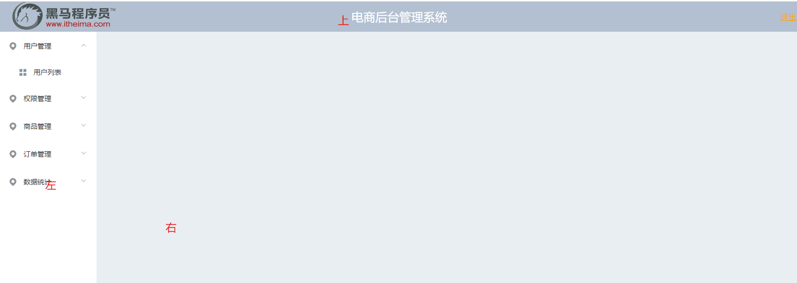
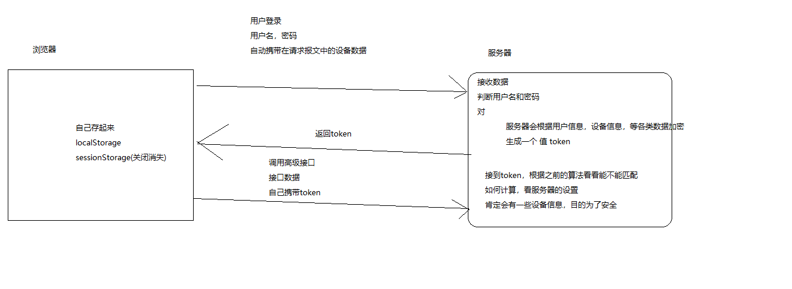

# Vue.js - day11


## ES6模块化导入、导出语法 

1. Node.js中的模块化标准是CommonJS
   1. 导入:require
   2. 暴露:module.exports
   
   
   
2. ES6的模块化语法
   
   2.1 ES6默认语法
   
   - 导入： 
     - import xxx from '模块'
   - 导出（暴露）
     - export default 名字
   
   
   
   2.2 按名字导入导出
   
   - 导入：
     - import {名字} from '模块'
   - 导出
     - export const 名字 = 值
   - 注意：
     - 导出时必须要赋值
     - 你导出的名字叫什么，导入的时候取的时候也要叫什么，名字跟导出的不匹配，就得到undefined
     - 在按名字导出的模块里，也可以再用默认导出，用什么方式导出的就要用对应的方式导入
   
   
   
   > 总结：导入的时候 import {} 加了大括号，都是按名字找用名字导出的  不加{}都是找默认导出
   >
   > 按名字导入，名字必须跟导出的一样， 默认导入随便写名字
   
   

## 黑买-router-路由抽取

> 独立的功能最好抽成独立的模块，好处：1.如果以后其他地方也用，可以直接导入一下就行了  2. 利于维护 3.代码看起来更整洁专业

1. components:
   1. 功能类的组件
   2. 局部区域的组件
2.  src里新建
   1. views/（视图）
      1. 页面级别的组件：铺满一页的组件
   2. router/
      1. router.js
      2. 把main.js中所有和路由相关的部分 抽取出来
      3. 暴露router出去
3. main.js中
   1. 导入抽取的 router即可
4. 组件修改位置之后，导入的路径同步修改
5. 如果文件只需要让外部访问一个内容，可使用export default
6. 工作中，这些文件夹的建立一般是leader，架构师来做


## axios - 实例创建 - 多基地址设置

[传送门](https://github.com/axios/axios#creating-an-instance)

1. 只需要使用axios的create创建多个新的axios对象，每个对象设置一个不同的基地址
2. 请求某个基地址的时候，使用该新对象的对应方法即可

```js
const instance = axios.create({
  baseURL: 'https://some-domain.com/api/',
});
```


## axios - 请求接口抽取成函数

1. 让接口的调用更加规范，不会因为地址的问题而困扰
2. 如果接口地址调整，只需要修改一个地方即可
3. 这种抽法，不在需要和axios和原型绑定了，用哪个方法就倒入哪个方法即可

## 后台 - axios 抽取

1. src新建文件夹
   1. api/ 
      1. api.js
      2. http.js(用这个)
2. 下载axios
3. 找到接口的基地址 设置
   1. 接口文档

## 饿了么ui - 表单验证

[传送门](https://element.eleme.cn/#/zh-CN/component/form#biao-dan-yan-zheng)

1. el-form 设置rules 对应表单的验证规则
2. el-form-item  和rules中的某个规则关联
3. 调用饿了么ui的表单的`validate `方法
   1. valid有值：true
   2. valid没值: 验证失败

## 后台 - axios接口化抽取

1. 根据接口文档抽取调用的接口为方法
2. 用到的地方 导入 这个方法
3. import { login} from'api/http'

## 后台 - 登录功能实现

1. views/login.vue
2. 为提交按钮绑定点击事件
3. 表单验证
   1. 错：提示用户
   2. 对：提交数据 导入 login方法
4. .then
   1. 对：提示用户，去首页
   2. 错：提示用户，
5. 判断成功的依据不要用中文用状态码，更加通用
6. 弹出的提示消息，可以自己写，也可以直接用服务器返回的内容
7. $message.success('xxx') 等同于$message({type:"success",message:"xxx"})

## 后台 - 首页组件布局



[传送门](https://element.eleme.cn/#/zh-CN/component/container)

1. 页面布局中就是这个结构
2. 默认的结构只有盒子，没有尺寸和颜色，这些你需要自己添加

```html
<el-container>
  <el-header>Header</el-header>
  <el-container>
    <el-aside width="200px">Aside</el-aside>
    <el-main>Main</el-main>
  </el-container>
</el-container>
```

## token

1. 名字是令牌
2. 服务器根据你当前环境生成的
   1. cookie:
      1. 服务器自动返回
      2. 浏览器自动保存，
      3. 自动发送
   2. token
      1. 服务器在数据中返回
      2. 浏览器不会自动保存
      3. 后续的数据提交，不会自动携带
      4. 所以如果服务器是用token验证，你还需要写代码把token保存在浏览器
      5. 并且发送请求时，要取出来再发给服务器



1. 增加的逻辑

   1. 登录成功之后本地保存
      1. localStorage
         1. 关闭之后状态还在 用这个
      2. sessionStorage（）
         1. 浏览器关闭之后状态 消失
         2. session(会话)：打开浏览器->关闭浏览器
   2. 调用高级接口时，人为携带

   

## 饿了么ui - 导航菜单

[传送门](https://element.eleme.cn/#/zh-CN/component/menu)

1. 直接搜 ”导航菜单“ 或者搜 ”nav"
2. 找到想要的效果，复制粘贴
3. default-active="2-1" 设置默认选中的页码
4. @open 当展开调用的事件 @close当关闭调用的事件
5. 我们项目里不需要默认选中和事件，这两个都可以删了
6. index属性代表每个菜单的页码
7. 布尔类型的属性，属性名前面不加冒号，你给任何值都是true，加了冒号才是真正当布尔类型解析
8. unique-opened属性：设置是否只允许同时展开一个


## 发请求带token

- 默认情况不会自动发token
- 如果某个接口需要token验证，那么就需要发请求时在请求头里面，加一个 `Authorization`
- 它的值为token的值
- 代码如下：

```js
return http.get('menus',{

        headers:{

            //key: value
            Authorization: window.localStorage.getItem('token')
        }
    })
```

## 后台 - 用户登出

[传说门2]https://element.eleme.cn/#/zh-CN/component/message-box)

1. 基于token的登录，需要开发人员自行维护token的值
2. 登录成功之后存起来
   1. login.vue
   2. 登录接口成功时保存
3. 退出的时候，删除token
   1. 弹框提示用户
      1. 确认：删除token 去登录页
      2. 取消：什么都不用干
4. 自行维护token，
   1. 登录时，加
   2. 退出时，删

 


