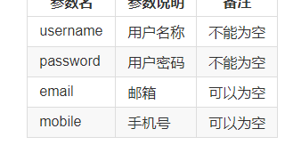

# Vue.js - day13


## 饿了么ui - table-基本使用

[传送门](https://element.eleme.cn/#/zh-CN/component/table#table-biao-ge)

```html
 <el-table :data="tableData" style="width: 100%" border>
      <el-table-column type="index" width="50"></el-table-column>
      <el-table-column prop="time" label="时间" width="180"></el-table-column>
      <el-table-column prop="name" label="外号" width="180"></el-table-column>
      <el-table-column prop="address" label="地址"></el-table-column>
      <el-table-column prop="food" label="美食"></el-table-column>
    </el-table>
```

1. data:表格的数据，就是根据它生成每行数据的
2. label:设置表头显示的文字
3. prop:数据和列的对应关系（数据里的属性名跟prop的值对应）
4. index:索引
5. border:边框


## 饿了么ui - table-自定义列模板 

[传送门](https://element.eleme.cn/#/zh-CN/component/table#zi-ding-yi-lie-mo-ban)

```html
 <!-- table -->
    <el-table :data="tableData" style="width: 100%">
      <el-table-column prop="date" label="日期" width="180">
        <!-- <template> -->
        <input type="button" value="点我试试" />
        <input type="text" placeholder="你好吗！" />

        <!-- </template> -->
      </el-table-column>
      <el-table-column prop="name" label="姓名" width="180">
        <template slot-scope="scope">
          <h2>{{scope.row.date}}</h2>
        </template>
      </el-table-column>
      <el-table-column prop="address" label="地址">
        <template slot-scope="scope345678o9p">
          <p>{{scope345678o9p.row}}</p>
        </template>
      </el-table-column>
    </el-table>
```

1. template: 设置一个 slot-scope='key' 就可以通过`key.row`获取这一行的数据
2. 直接在el-table-column 内部写其他标签能够解析
3. 但是为了使用数据
   1. template slot-scope
   2. 内部包裹自定义的结构


## 饿了么ui - switch开关

[传送门](https://element.eleme.cn/#/zh-CN/component/switch)

```html
<el-switch v-model="person.row.isMan" active-color="#0094ff" inactive-color="hotpink"></el-switch>
```

1. v-model绑定布尔值
2. active-color:开启的颜色
3. inactive-color:关闭的颜色


### 使用注意：

1. 开关要想能用，必须给v-model绑定一个数据
2. 开关如果放在其他地方，可以让v-model直接访问data里的属性
3. 开关如果放在表格里，不能直接让v-model访问data里的属性（就无法用）
4. 如果表格里要用自定义列模板，再访问当前表格这一行的数据（slot-scope="scope"）

## 饿了么ui - 按钮

[传送门](https://element.eleme.cn/#/zh-CN/component/button)

```html
<el-button type="primary" icon="el-icon-edit" plain size="mini"></el-button>
```

1. plain 方形，没有填充色
2. size：mini 最小
3. icon:图标
4. type:颜色

## 饿了么ui - 对话框

[传送门](https://element.eleme.cn/#/zh-CN/component/dialog)

1. 对话框的结构 需要执行准备
2. 可以通过一个标记的字段显示和隐藏  true  false
3. 内部的结构可以根据需求调整以文档的模板 作为实例即可
4. 点击切换 密码的显示 用的是修改type
   1. 准备可以点击的标签
   2. 点击之后修改type即可

## 后台 - 用户管理 - 用户新增 - 弹框

## 后台 - 用户管理 - 用户新增 - 表单验证

1. 点击添加的时候
2. 使用表单验证
3. data中添加一个对象 内部包含了所有的数据
4. rules 验证规则
5. prop 使用哪套规则
6. 字段4个
7. el-form 顶级标签
   1. rules
   2. ref
8. el-form-item:prop设置验证规则
9. 点击提交调用验证方法本质  el-form.validate
10. valid 是否有值决定了对错

##  后台 - 用户管理 - 用户新增 - 点击新增

1. 抽取接口/api
2. 点击提交时
   1. 错：提示用户
   2. 对：调用接口提交数据
      1. 调用成功之后
      2. 重新获取数据 调用`search`
3. 不是所有的成功都是200
4. 服务器返回的状态码有很多种
   1. 成功 2xx
   2. 失败 4xx
   3. 服务器错误:5xx


## 后台 - 用户管理 - 状态改变 

1. 抽取接口
2. switch绑定chang事件
3. change事件触发的时候，调用接口提交数据
   1. 服务器返回内容之后
   2. 本地重新获取数据？
      1. 本地已经改变了，
      2. 调用之后本地也不会改变
      3. 浪费了一次请求
      4. 可以选择不调用
4. 传递参数是，如果可以，尽可能都给他，以备不时之需
5. 服务器状态改变之后，本地可以选择不刷新，减少请求次数


## 后台 - 用户管理 - 修改用户

1. 先准备一个修改界面的对话框
2. 给修改按钮加点击事件
3. 点击事件弹出对话框，在点击之前要传入被点击的这行的数据，再把这行数据赋值给修改对话框双向绑定的对象数据
4. 记得给对话框里的用户名加disabled
5. 给里面的确定按钮加点击事件，点击事件里拿到修改后的数据，发请求到接口

## 后台 - 用户管理 - 点击删除

1. 抽取删除接口
2. 点击删除时
   1. 弹框
   2. 不确认：啥事不干
   3. 确认：调用删除接口
   4. 删除成功之后
   5. 重新获取数据
3. 比较暴力的操作，一般会先提示用户
   1. 删除
   2. 修改
   3. 退出


## 父组件 -> 子组件 传值

> 场景：子组件有些值不能写死，需要谁调用我，谁给我值。这就需要父子组件传值

步骤：

1. 子组件里些一个 props， 它是一个数组，数组里定义需要几个值

   例：

   ```js
   props: ["first", "second"]  //代表需要2个，分别叫first和second
   ```

2. 在调用这个子组件的地方，写标签，在给标签里写行内属性，依次传值

```html
<bread first='权限管理' second='权限列表'></bread>  代表给bread传递first和second两个值
```


## 封装面包屑

- 新建一个vue文件
- 把面包屑的html部分复制进去，还有less部分
- 做成全局组件（因为好多地方用，在main.js里导入）


## 接口的请求方法和 &restful api

- 常用的请求方式：get和post
- 但是现在越来越多的程序员推荐接口要用restful原则：
- 让人一看接口地址，和请求方式，就知道这个接口可以用来干嘛！
- /user  请求方式：get    跟用户有关，获取用户
- /user  请求方式：post  跟用户有关，新增用户
- /user  请求方式：put  跟用户有关，修改用户
- /user  请求方式：delete  删除用户

1. 网络请求设计方法时，考虑到数据的操作主要：增删改查，方法的命名可以体现这个操作
   1. GET（SELECT）：从服务器取出资源（一项或多项）。
   2. POST（CREATE）：在服务器新建一个资源。
   3. PUT（UPDATE）：在服务器更新资源（客户端提供改变后的完整资源）
   4. DELETE（DELETE）：从服务器删除资源。
   5. PATCH（UPDATE）：在服务器更新资源（客户端提供改变的属性）。
   6. HEAD：获取资源的元数据。
   7. OPTIONS：获取信息，关于资源的哪些属性是客户端可以改变的。
2. get和post已经够用了，其他的用的不多
4. 工作中，如果后台提供的接口是 这个类型的
   1. axios都可以点出来
   2. 原生 xhr.open('方法名',)
5. 面试：说一下请求方式有哪些
   1. 如果问到这种题目，只答get和post比较扣分
   2. 常见的有get和post，但实际还有一堆请求方法，例如put,delete,options,head,path
   3. 为什么要有这么多请求方式呢？因为设计之初是想不同的请求方式去做不同的操作，这样就能细分，而且现在写接口有一个规范，restful规范，需要别人一看地址就知道操作什么数据，让人一看请求方式就知道是做什么样的操作是新增、查询、还是修改删除

