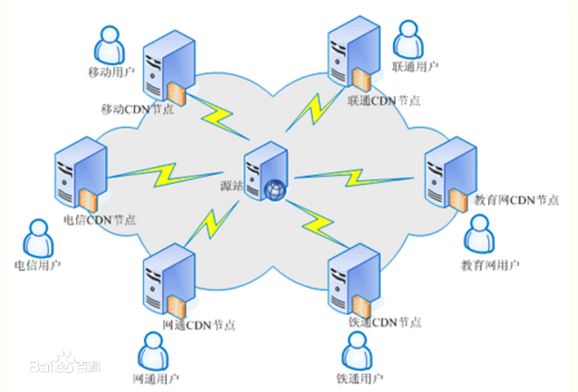
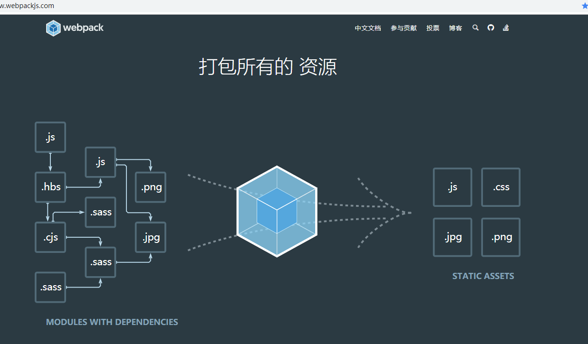

# Vue.js - day16

## 图表真实数据显示

- 准备一个 `reports.vue` 的页面:面包屑、图表的div
- 发请求获取数据（mounted，因为这个钩子里才能访问到div）
- 把请求的数据，赋值给option对应的属性
- 注意：option.xAxis[0].boundaryGap 要设置为false，两边才不会留白

https://github.com/jcc/v-distpicker


## 省市区联动

- 用饿了么UI的级联选择器
  - 但是要预先找到数据，把数据作为级联选择器的数据
- 用插件：下包、导包、用包


## 面试题：权限管理

- 介绍项目特点：这个项目我们当初用到了权限管理
- 因为我负责的是前端，所以我做起来比较简单
- 只是对接口发请求，拿到数据渲染
- 但是我个人对这技术又感兴趣，我也想知道凭什么我登录不同的账号就能显示不能的权限
- 于是我请后端吃个饭，请教他到底做了什么事
- 他告诉我说，我们这个项目一共有三张表：用户表、角色表、权限表
- 先根据 用户名（用户id） 查找用户表，得到这个用户的 角色id ，再根据角色id 去角色表里 查到这个账号所属的角色，得到所属的角色后，就能得到这个角色里拥有的 权限的id  再根据 权限的id 去查权限表里的权限，再返回回来就行了


## 项目打包


1. 项目做完要上线
2. 打包
   1. 压缩合并html
   2. 压缩合并css
   3. 压缩合并js
   4. 添加兼容性代码
   5. 等等
3. 一般用的是webpack来做这件事
4. 我们的项目vue-cli搭建的，vue_cli内部就是基于webpack的封装
5. 我们只需要 `npm run build`
6. 打包好之后
   1. 给后端
   2. 或者是运维
7. 上线的本质是吧本地的代码 上传到远程服务器
8. 所有的资源的路径都是网站的根目录
   1. 一般为了性能考虑 一个服务器就跑一个项目
9. 可以自行调整路径从/ 到./

## 项目打包设置 01 - 修改路径

[传送门](https://cli.vuejs.org/zh/config/#publicpath)

1. 项目根目录下 创建一个`vue.config.js`(默认不存在的)，package.json同级
2. 内部通过暴露的对象的语法，添加自己的设置即可
3. 比如这里

```js
// vue.config.js
module.exports = {
  // 打包的根路径 使用的是相对
  publicPath:'./'
}
```

4. npm run build 就回应用这个设置重新打包

## 项目打包设置 02 - 移除map文件

[传送门](https://cli.vuejs.org/zh/config/#productionsourcemap)

[map文件作用](https://webpack.docschina.org/guides/development/#%E4%BD%BF%E7%94%A8-source-map)

1. vue.config.js
2. 增加一组键值对`productionSourceMap:false`

## vue项目首次加载提速01 - 路由懒加载

[传送门](https://router.vuejs.org/zh/guide/advanced/lazy-loading.html)

1. 所有文件都合并到了一起，用户不一定会都打开
2. 而我却都加载了
3. 组件的导入时，使用`const Foo = () => import('./Foo.vue')`即可实现懒加载
4. router.js
5. 请求不同路由时，加载这个路由对应的js和css，首次的加载量少了，首次速度快一些

### 懒加载能不能提速

1. 把时间分开了
2. 总时间没有变

## vue项目加载提速02 - cdn加速

[webpack设置](https://webpack.docschina.org/configuration/externals/#src/components/Sidebar/Sidebar.jsx)

[vue-cli中合并webpack配置](https://cli.vuejs.org/zh/guide/webpack.html#%E7%AE%80%E5%8D%95%E7%9A%84%E9%85%8D%E7%BD%AE%E6%96%B9%E5%BC%8F)

1. 抽取不再需要打包的文件到index.html中
2. 增加`vue.config.js`
3. 输入一下内容

```
module.exports = {
    // 这里面直接写webpack的配置即可 
    // 抽取 bundle 打包的时候 直接忽略
      // 跟webpack的配置合并
  configureWebpack: {

    // 告诉打包程序：vue，vue-router，axios,element-ui不要打包生成
    // 而是导入CDN的文件就行
    externals: {
      // 键：模块名字
      // 值：导入后它叫什么名字
      'vue': 'Vue',
      'vue-router': "VueRouter",
      'axios': 'axios',
      // element-ui这里的名字必须全部大写
      'element-ui': "ELEMENT"
    }
  }
  }
```

4. 网络第三方库查找
   1. bootcdn
   2. 模块的官网
5. 因为没有打包第三方模块文件更小了
6. 第一次加载速度更快一些
7. 把第三方模块的引入，从本地，变为网络资源


##  cdn



1.  缺点：
   1. 所有的服务器都需要同步相同的内容
   2. 更新了网站之后
   3. 全网同步需要时间
   4. 一般都是半夜更新
   5. 运维
2. 把一个服务器中的内容，放到多个不同地域的服务器中，
3. 用户访问时就近原则
4. 要么自己买服务器
5. 要么找供应商，花钱

## vue项目加载提速03 -通用方案

1. 充钱买带宽！服务器返回数据的速度更快
2. 使用静态资源服务器
   1. 网站的静态资源专门用一个服务器放
   2. 图片
   3. 用户在请求时
      1. 图片一个服务器的流量
      2. 网站一个服务器的流量
   4. 七牛云
   5. 所有的图片 相对路径==>静态资源服务器的网络地址
3. gzip压缩（压缩比更大的压缩格式）
   1. 服务器用到的一种压缩资源格式
   2. 需要运维开启一个设置
4. webp文件格式
   1. 谷歌退出的一种格式
   2. 图片精度差别不大的情况下，容量小了不少
   3. ui转成这个格式即可
5. 请求减少
   1. 不打包第三方模块，cdn加速有冲突
   2. 降低自己服务器的压力
   3. 自己的项目逻辑，合并到一起，所有的css合并到一起
   4. 第三方资源 打包浪费空间，请求其他服务器的资源
6. 精灵图
7. base64：编码格式，用它也可以代表一个图片，直接用base64不用把图片存到服务器
8. 懒加载
9. js 少用递归，闭包，嵌套循环，少用全局变量

## webpack - 基本概念

[传送门](https://www.webpackjs.com/concepts/)

1. 本质上，*webpack* 是一个现代 JavaScript 应用程序的*静态模块打包器(module bundler)*。 
2. 
3. 把前端开发中用到的所有资源都变成浏览器可以识别的资源
4. 文件的合并操作

## webpack - 打包起步

[传送门](https://www.webpackjs.com/guides/getting-started/)

1. 基于node的一个工具
2. 创建文件夹
   1. src： 写js代码（逻辑代码）
   2. dist文件夹：index.html  (导入当前目录的main.js（打包会生成的）)
3. 初始化项目 npm init -y
4. 安装 webpack  `cnpm install webpack webpack-cli --save-dev`
5. 打包 `npx webpack`

## webpack - 打包js模块

[传送门](https://www.webpackjs.com/guides/getting-started/#%E6%A8%A1%E5%9D%97)

1. 装jquery :npm i jquery 
2. 装moment :npm i moment 
3. cnpm i 模块名不会自动保存到package.json中
4. 需要 加上 --save

## webpack - 配置文件

[传送门](https://www.webpackjs.com/guides/getting-started/#%E4%BD%BF%E7%94%A8%E4%B8%80%E4%B8%AA%E9%85%8D%E7%BD%AE%E6%96%87%E4%BB%B6)

1. 设置webpack的打包方式 打包细节
2. 项目根目录下新增一个文件`webpack.config.js`
3. 执行`npx webpack --config webpack.config.js`
4. 自动读取这个文件进行打包
5. 配置直接看传送门中的示例即可

```js
// 导入 path 路径模块
const path = require('path');

// 暴露出去
module.exports = {
  // 打包路口（告诉webpack用到了什么东西）
  entry: './src/index.js',
  // 出口，打包到哪里去去
  output: {
    // 文件名
    filename: 'main.js',
    // 路径
    path: path.resolve(__dirname, 'dist')
  }
};
```


## npm -命令

[传送门](https://www.webpackjs.com/guides/getting-started/#npm-%E8%84%9A%E6%9C%AC-npm-scripts-)

1. package.json中支持我们记录一些比较长的命令（可以方便我们后面调用）
2. scripts分类中
   1. key:value
      1. key：命令的别名，到时候我们就可以 npm run key
      2. value：真正执行的命令
3. npm run key执行 value对应的命令了
4. 当你发现运行 `npm run xxx`的时候 可以去 `package.json`中一般 `scripts`分类中会有xxx对应的配置
5. vue-cli中就有


## webpack - dev-server

[传送门](https://www.webpackjs.com/guides/development/#%E4%BD%BF%E7%94%A8-webpack-dev-server)

1. dev 开发

2. server:服务器

3. 允许我们开启一个开发用的服务器，自动监听文件改变，自动打开浏览器，自动刷新浏览器

4. 装包`cnpm install --save-dev webpack-dev-server`

5. `webpack.config.js`中增加配置

6. 添加`package.json`中的scripts

   1. ```
       "start": "webpack-dev-server --open",
      ```

## webpack - loaders

[传送门](https://www.webpackjs.com/loaders/)

1. 其他的文件默认不支持解析
2. 提供了一个机制`loaders`,可以理解为是翻译官，
3. 让webpack拥有解析不同文件的能力
4. 不同的文件对应的loader不一样
5. webpack默认只能够解析js

## webpack - 打包css

[传送门](https://www.webpackjs.com/guides/asset-management/#%E5%8A%A0%E8%BD%BD-css)

1. 装包`cnpm install --save-dev style-loader css-loader`

2. 添加配置

3. ```js
     const path = require('path');
      
     module.exports = {
       entry: './src/index.js',
       output: {
         filename: 'bundle.js',
         path: path.resolve(__dirname, 'dist')
       },
   +   module: {
   +     rules: [
   +       {
   +         test: /\.css$/,
   +         use: [
   +           'style-loader',
   +           'css-loader'
   +         ]
   +       }
   +     ]
   +   }
     };
   ```

## webpack - 打包less

[传送门](https://www.webpackjs.com/loaders/less-loader/)

1. 装包 `cnpm install --save-dev less-loader less`
2. 配置规则

```
// webpack.config.js
module.exports = {
    ...
    module: {
        rules: [{
            test: /\.less$/,
            use: [{
                loader: "style-loader" // creates style nodes from JS strings
            }, {
                loader: "css-loader" // translates CSS into CommonJS
            }, {
                loader: "less-loader" // compiles Less to CSS
            }]
        }]
    }
};
```


## webpack - 打包sass

[传送门](https://www.webpackjs.com/loaders/sass-loader/)

## 自己搭建脚手架 - vue-loader

[传送门](https://vue-loader.vuejs.org/zh/)

1. 创建文件夹
2. npm init -y
3. 安装webpack
4. 准备项目目录
5. 给它加配置文件（修改package.json的配置）
   1. 入口、出口、script命令
6. 需要一个vue-loader
7. 开启小型服务器（装一个小型服务器工具） `cnpm install --save-dev webpack-dev-server`

### 脚手架，webpack定制前端开发环境

1. webpack 功能强大
2. 学习成本较高
3. 很多程序员怨声载道
4. 大型项目得用
5. 框架的开发团队
   1. 基于webpack封装了所有的功能，
   2. 你用得到的用不到的，都给你封装配置好了
   3. 让你直接可以拿来开发
   4. 做出了一个 脚手架的东西`xxx-cli`
6. 工作中
   1. 如果脚手架能够搞定的东西，直接上脚手架
   2. 如果脚手架搞不定：
      1. 基于脚手架调整设置
      2. 自己用webpack搭建开发环境 自己弄脚手架！
      3. 一般是leader来做
   3. 如果要能够做leader，一些webpack的设置要会
7. n+12中有webpack的高级定制
8. 面试发现公司要求webpack
   1. 公司自己搭
   2. 公司用的脚手架版本较老 比如2.x
   3. 开发的方式一样
      1. src里面
      2. 微信小程序中学习一个`mpvue`这个玩意是基于vue-cli2.x的
