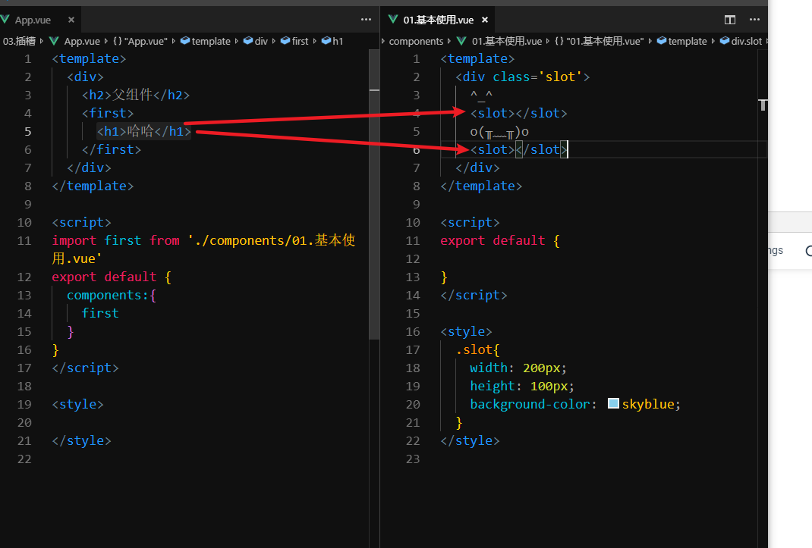
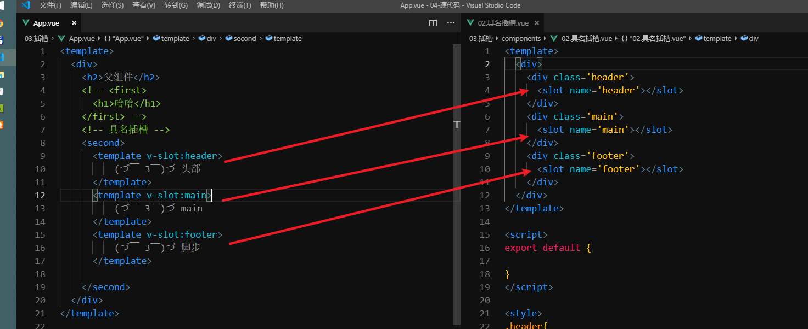
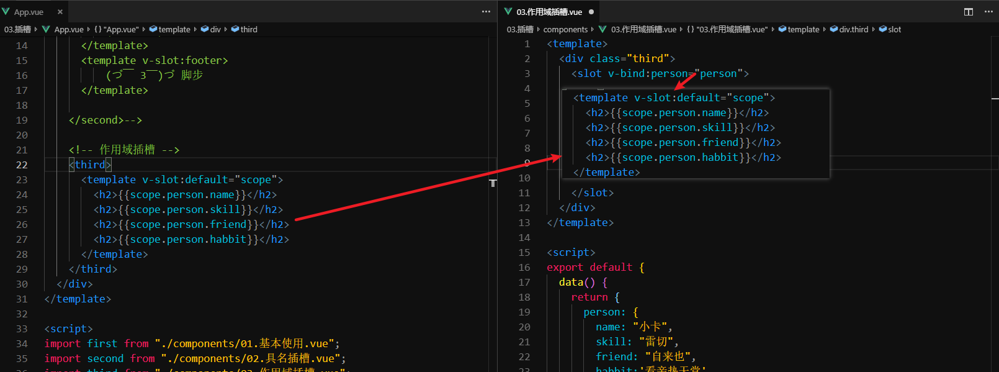
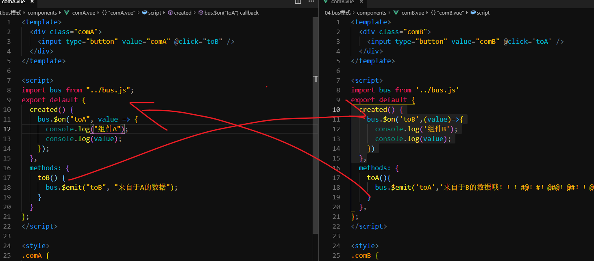
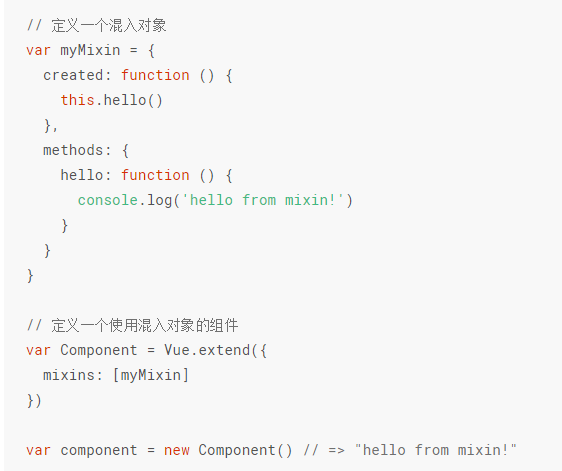
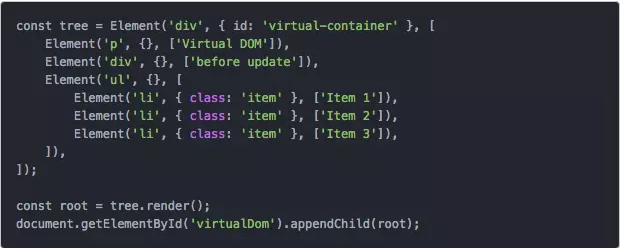

# Vue.js - day17

## webpack - 打包js模块

[传送门](https://www.webpackjs.com/guides/getting-started/#%E6%A8%A1%E5%9D%97)

1. 装jquery :npm i jquery 
2. 装moment :npm i moment 
3. cnpm i 模块名不会自动保存到package.json中
4. 需要 加上 --save

## webpack - 配置文件

[传送门](https://www.webpackjs.com/guides/getting-started/#%E4%BD%BF%E7%94%A8%E4%B8%80%E4%B8%AA%E9%85%8D%E7%BD%AE%E6%96%87%E4%BB%B6)

1. 设置webpack的打包方式 打包细节
2. 项目根目录下新增一个文件`webpack.config.js`
3. 执行`npx webpack --config webpack.config.js`
4. 自动读取这个文件进行打包
5. 配置直接看传送门中的示例即可

```js
// 导入 path 路径模块
const path = require('path');

// 暴露出去
module.exports = {
  // 打包路口（告诉webpack用到了什么东西）
  entry: './src/index.js',
  // 出口，打包到哪里去去
  output: {
    // 文件名
    filename: 'main.js',
    // 路径
    path: path.resolve(__dirname, 'dist')
  }
};
```


## npm -命令

[传送门](https://www.webpackjs.com/guides/getting-started/#npm-%E8%84%9A%E6%9C%AC-npm-scripts-)

1. package.json中支持我们记录一些比较长的命令（可以方便我们后面调用）
2. scripts分类中
   1. key:value
      1. key：命令的别名，到时候我们就可以 npm run key
      2. value：真正执行的命令
3. npm run key执行 value对应的命令了
4. 当你发现运行 `npm run xxx`的时候 可以去 `package.json`中一般 `scripts`分类中会有xxx对应的配置
5. vue-cli中就有


## webpack - dev-server

[传送门](https://www.webpackjs.com/guides/development/#%E4%BD%BF%E7%94%A8-webpack-dev-server)

1. dev 开发

2. server:服务器

3. 允许我们开启一个开发用的服务器，自动监听文件改变，自动打开浏览器，自动刷新浏览器

4. 装包`cnpm install --save-dev webpack-dev-server`

5. `webpack.config.js`中增加配置

6. 添加`package.json`中的scripts

   1. ```
      "start": "webpack-dev-server --open",
      ```

## webpack - loaders

[传送门](https://www.webpackjs.com/loaders/)

1. 默认只支持js文件，其他的文件默认不支持解析
2. 提供了一个机制`loaders`,可以理解为是翻译官，
3. 让webpack拥有解析不同文件的能力
4. 不同的文件对应的loader不一样

   

## webpack - 打包css

[传送门](https://www.webpackjs.com/guides/asset-management/#%E5%8A%A0%E8%BD%BD-css)

1. 装包`cnpm install --save-dev style-loader css-loader`

2. 添加配置

3. ```js
   const path = require('path');
    
   module.exports = {
     entry: './src/index.js',
     output: {
       filename: 'bundle.js',
       path: path.resolve(__dirname, 'dist')
     },
   +   module: {
   +     rules: [
   +       {
   +         test: /\.css$/,
   +         use: [
   +           'style-loader',
   +           'css-loader'
   +         ]
   +       }
   +     ]
   +   }
     };
   ```

## webpack - 打包less

[传送门](https://www.webpackjs.com/loaders/less-loader/)

1. 装包 `cnpm install --save-dev less-loader less`
2. 配置规则

```
// webpack.config.js
module.exports = {
    ...
    module: {
        rules: [{
            test: /\.less$/,
            use: [{
                loader: "style-loader" // creates style nodes from JS strings
            }, {
                loader: "css-loader" // translates CSS into CommonJS
            }, {
                loader: "less-loader" // compiles Less to CSS
            }]
        }]
    }
};
```


## webpack - 打包sass

[传送门](https://www.webpackjs.com/loaders/sass-loader/)

## 自己搭建脚手架 - vue-loader

[传送门](https://vue-loader.vuejs.org/zh/)

1. 创建文件夹
2. npm init -y
3. 安装webpack
4. 准备项目目录
5. 给它加配置文件（修改package.json的配置）
   1. 入口、出口、script命令
6. 需要一个vue-loader
7. 开启小型服务器（装一个小型服务器工具） `cnpm install --save-dev webpack-dev-server`

### 脚手架，webpack定制前端开发环境

0. 公司做自己框架，会考虑高度定制webpack

1. webpack 功能强大
2. 学习成本较高
3. 很多程序员怨声载道
4. 大型项目得用
5. 框架的开发团队
   1. 基于webpack封装了所有的功能，
   2. 你用得到的用不到的，都给你封装配置好了
   3. 让你直接可以拿来开发
   4. 做出了一个 脚手架的东西`xxx-cli`
6. 工作中
   1. 如果脚手架能够搞定的东西，直接上脚手架
   2. 如果脚手架搞不定：
      1. 基于脚手架调整设置
      2. 自己用webpack搭建开发环境 自己弄脚手架！
      3. 一般是leader来做
   3. 如果要能够做leader，一些webpack的设置要会
7. n+12中有webpack的高级定制

## Vuex - 基本概念

1. 集中管理所有组件的数据
2. 可以把它理解为是一个仓库
3. 所有的组件都可以拿，所有的组件都可以改

[传送门](https://vuex.vuejs.org/zh/)

## Vuex - 基本使用

1.下包

2.导包

​	记得要用Vue.use(vuex)

3.实例化vuex对象

4.挂载到vue的对象里

5.$store.state.属性名

## Vuex - state

1. 数据
2. 所有组件都可以用
3. `$store.state.xxx`
4. 代码中`this.$store.state.xxx`
5. 可以结合计算属性使用

## Vuex - mutation

1. 所有的组件中都可以 修改数据
2. `this.$store.commit('方法名',参数)`
3. 方法定义在
4. 仓库的mutations内部
5. 在chrome中可以看到每次提交的内容方便调试


## Vuex - getters

- vuex中的计算属性


## Vue-cli功能补充 - 快速原型开发

[传送门](https://cli.vuejs.org/zh/guide/prototyping.html)

1. ```bash
   npm install -g @vue/cli-service-global
   ```

2. 下包

1. 直接把一个xxx.vue跑起来
2. vue serve xxx.vue （xxx是文件名）

## Vue 组件封装 - 子到父数据传递

[传送门](https://cn.vuejs.org/v2/guide/components.html#%E7%9B%91%E5%90%AC%E5%AD%90%E7%BB%84%E4%BB%B6%E4%BA%8B%E4%BB%B6)

1. props (父传子)
   1. 子组件定义 props属性 props:['num','max','min']
   2. 父组件使用子组件时 `<comSon  num='xxx' max='xx' min='x'></comSon>`
2. $emit（子传父）
   1. 子组件中，特定的时候 触发`this.$emit('事件名''参数')`
   2. 父组件中`<com @事件名='自己的方法'></com>`

## Vue 组件封装 - 在子组件上使用v-model(v-model的本质)

[传送门](https://cn.vuejs.org/v2/guide/components.html#%E5%9C%A8%E7%BB%84%E4%BB%B6%E4%B8%8A%E4%BD%BF%E7%94%A8-v-model)

子组件中 绑定2个东西

```html
Vue.component('base-checkbox', {
  model: {
    prop: 'checked',
    event: 'change'
  },
  props: {
    checked: Boolean
  },
  template: `
    <input
      type="checkbox"
      v-bind:checked="checked"
      v-on:change="$emit('change', $event.target.checked)"
    >
  `
})
```

v-model本质就是 v-bind 和v-on的组合

v-model会跟子组件里的model属性进行一一对应，event里面写了什么(例change)，就相当于给父组件加了一个@change，子组件里对应的时机，用$emit就把数据推给父组件了

## Vue 组件封装 - 插槽

[传送门](https://cn.vuejs.org/v2/guide/components.html#%E9%80%9A%E8%BF%87%E6%8F%92%E6%A7%BD%E5%88%86%E5%8F%91%E5%86%85%E5%AE%B9)



1. 默认情况下，在组件里不能加别的标签
2. 插槽的作用就是让我们可以加别的标签

## Vue 组件封装 - 具名插槽

[传送门](https://cn.vuejs.org/v2/guide/components-slots.html#%E5%85%B7%E5%90%8D%E6%8F%92%E6%A7%BD)

  

1. 给插槽取名字（slot标签里写一个 name属性）

2. 在使用这个子组件的地方，要包一个template，用 v-slot:name名 绑定，告诉他填充到哪个插槽
3. name名不要加引号

## Vue组件封装 - 作用域插槽

[传送门](https://cn.vuejs.org/v2/guide/components-slots.html#%E4%BD%9C%E7%94%A8%E5%9F%9F%E6%8F%92%E6%A7%BD)

1. 让插槽可以使用组件内部的数据
2. 
3. 把子组件暴露的数据在父组件传入的结构中获取
4. 饿了么的slot-scope就是这个，但是在v3会被废弃
5. 不知道10月份vue3更新之后，饿了么会不会推出新版本
   1. 9月30日

## Vue组件数据传递 -bus模式

[传送门](https://cn.vuejs.org/v2/guide/migration.html#dispatch-%E5%92%8C-broadcast-%E6%9B%BF%E6%8D%A2)

1. 很早就不在流行了
2. 问你这个问题基本就是看你 做了多久
3. bus可以实现兄弟传值
4. 实例化一个Vue 作为传递的中间对象
5. 通过它来传递数据
6. 
7. 用法较为复杂，需要在多个组件中监听和触发事件
8. 不利于维护
9. 简单的小项目

## Vue组件 - 边界情况

[传送门](https://cn.vuejs.org/v2/guide/components-edge-cases.html)

1. Vue的偏门
2. 不建议用
3. this.$root 获取顶级组件
   1. this.$root.数据 取值赋值
4. this.$parent 父组件
5. this.$children子组件(数组)
6. this.$refs.xxx 起了别名的组件（找DOM元素）
7. 边际，最高可以拿到顶级实例
8. 最低或可以获取到最低级的后代vue实例
9. 不建议这么高，用推荐的语法，让数据的更改变得可控


## Vue - mixin混入

[传送门](https://cn.vuejs.org/v2/guide/mixins.html)



1. 把组件内部公共的部分抽取出来
2. 每次要创建组件是，可以把这部分内容合并进去

## Vue - keep -alive

[传送门](https://cn.vuejs.org/v2/api/#keep-alive)

1. 作用让组件不被销毁
2. 2个新的钩子
3. 包裹之后组件不会被销毁，会被保存到内存中，
4. 再次显示时，状态还在
5. `deactivated`  
6. `activated`  
7. 这两个钩子必须结合`keep-alive`才可以使用
8. 算上这2个钩子一起有10个钩子

## Vue.set

[传送门](https://cn.vuejs.org/v2/api/#Vue-set)

1. 本来data中没有的属性，通过.语法添加上去之后
2. vue不能够跟踪数据的改变
3. 如果必须要动态的增加属性 可以使用`this.$set`
4. 如果是直接给data的属性赋值 内部会对这些属性全部set一下
5. 赋值之后再去.xxx =xxx 这种不会再去设置了
6. 参数
   1. 对象
   2. 属性名
   3. 值
7. 坑点
   1. 动态增加属性无法更新
   2. 找到了Vue.set 
   3. set的本质是Vue双向绑定原理  Object.defineProperty

## Vue.use

[传送门](https://cn.vuejs.org/v2/api/#Vue-use)

1. 执行插件对象中的install方法
2. 把Vue的构造函数传入
3. 内部就可以为构造函数添加原型属性
4. 或者是注册全局的组件 过滤器等
5. 饿了么ui就是这么做的
6. 用它的时候要use一下
   1. $message设置给原型
   2. el-input这些组件页都是全局注册


## Vue虚拟dom & Vue的diff算法& key的作用

[传送门1-官方解释](https://cn.vuejs.org/v2/guide/render-function.html#%E8%8A%82%E7%82%B9%E3%80%81%E6%A0%91%E4%BB%A5%E5%8F%8A%E8%99%9A%E6%8B%9F-DOM)

[传送门2-官方解释](https://cn.vuejs.org/v2/api/#key)

[Vue-虚拟dom--diff算法](https://www.jianshu.com/p/af0b398602bc)

1. 虚拟dom是用js的对象在内存中描述出一个类似于dom树的结构
2. 
3. 数据改变时，现在内存中的用js表示的虚拟dom上，进行计算匹配对比，最终匹配出所有更改的元素
4. 在同步到页面上
5. beforeUpdate
6. updated
7. dom元素非常多，为了尽可能高效的计算出结果，建议我们给个key 唯一的标记
8. 不给key可能会浪费一些性能
9. 浪费的是浏览器时（客户端）

## Vue数据响应式原理- Object.defineProperty

[传送门](https://cn.vuejs.org/v2/guide/reactivity.html)

1. Object.defineProperty为对象动态的增加一个属性
2. 我们在为这个对象的属性 取值 或者赋值时
3. 会触发 get  和set方法
4. 在这个方法中就可以去执行自定义的逻辑了
5. 比如操纵dom元素
6. vue2.x的数据响应原理
7. 但是这个方法 不支持ie8及以下，所以Vue不考虑ie8

## Vue数据响应式原理 3-proxy

[传送门](https://www.jianshu.com/p/2a8ec76e0090)

```
  let data = {}
  
  // new proxy对象
  let proxyData = new Proxy(data,{
    get(obj,prop){
      console.log('get')
      console.log(obj)
      console.log(prop)
      return obj[prop]
    },
    set(obj,prop,value){
      obj[prop]= value
      console.log('set')
      console.log(obj)
      console.log(prop)
      console.log(value)
    }
  })
```

1. proxy设置之后
2. 所有对这个对象S属性的取值和赋值都会触发 get和set
3. 无论属性名是什么
4. 当vue3用了proxy之后，就不在需要Vue.set了
5. proxy出来之后，尤雨溪，proxy挺有意思的，试试看
6. vue3.决定用它了

## MVC

[传送门](https://www.jianshu.com/p/c4fe16537594)

后端的

M:model 模型

V:View 视图

C:controller 控制器（逻辑代码）

让我们强制把代码分成三个部分，每个部分执行自己的逻辑，更加利于代码的组织

## MVVM

[传送门](http://baijiahao.baidu.com/s?id=1596277899370862119&wfr=spider&for=pc)

1.前端中现在的框架 vue 小程序 react 都是这个

M:Model

​	data:

​	ajax获取的

V:View

​	template

VM:ViewModel

​	vue实例

​	把数据和view合并到一起

## 项目上线

[传送门](https://www.cnblogs.com/zhaowy/p/8400405.html)


## 传送门

[Vue.delete](https://cn.vuejs.org/v2/api/#Vue-directive)

[vue原理剖析](https://juejin.im/user/59ee29a36fb9a0451c3990e5/posts)

[es6,7,8,9,10新特性一览](https://juejin.im/post/5ca2e1935188254416288eb2)

[iView-基于Vue的ui框架](https://www.iviewui.com/)

[Cube-ui-移动端Vue组件库](https://didi.github.io/cube-ui/#/zh-CN/example)

[Mint-ui -饿了么团队开发的移动端Vue组件库](http://mint-ui.github.io/#!/zh-cn)

[Vux-未适配vue-cli3.x的移动端ui库](https://doc.vux.li/zh-CN/)

[mui  HBuilder团队开发的移动端框架](http://dev.dcloud.net.cn/mui/)

[D2-admin 现成的后台管理界面](https://d2admin.fairyever.com)

[iView-admin 基于iView搭建的后台管理页面](http://admin.iviewui.com/login)

[Element - admin 基于Elementui实现的后台管理页面](https://panjiachen.github.io/vue-element-admin-site/zh/)

[vue-resource（早期结合Vue的网络请求库）](https://github.com/pagekit/vue-resource)

[为什么不在推荐vue-resource](https://medium.com/the-vue-point/retiring-vue-resource-871a82880af4#.2rkai1shx)

[vue-i18n国际化](https://github.com/kazupon/vue-i18n)

​	让vue的可以支持多国语言

[es-lint](https://cn.eslint.org/)

​	代码规范

​	如何缩进，如何换行

​	小黑窗的错误哦 根据提示 改了

​	大公司

要不要分号

type-script

vue3直接支持，

与其用规则去约束别人

不如用 代码去规范别人

[mutaion必须是异步](https://vuex.vuejs.org/zh/guide/mutations.html#mutation-%E5%BF%85%E9%A1%BB%E6%98%AF%E5%90%8C%E6%AD%A5%E5%87%BD%E6%95%B0)

[异步可以使用action](https://vuex.vuejs.org/zh/guide/actions.html#action)

# 面试神题，加分项

[输入url到看到页面到底干了什么](https://www.cnblogs.com/dailc/p/8547384.html)


