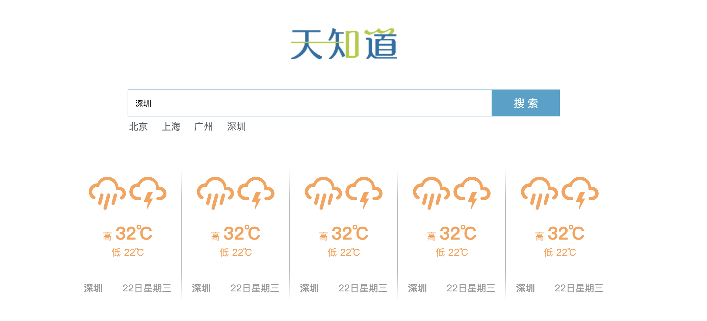
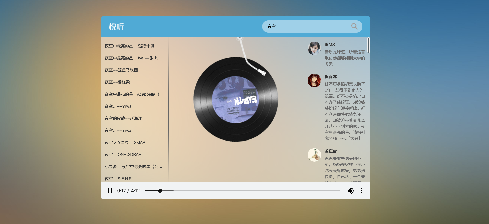

#                        Vue框架学习 - 第三天


##（1）vue基础知识课程回顾

前面两天在侨文老师的课堂里，同学们学习的了Vue的相关基础指令，我们先来简单的过一遍：
1. v-text，也叫胡子语法，{{}} 插值表达式，类似innerText操作。
2. v-html，类似于 innderHtml操作，支持html标签解析。
3. v-on: 事件绑定，简写是 @，调用 methods 中的方法。
4. v-bind: 动态属性绑定，简写就是一个 ：冒号，将data里面的数据绑定到标签行内属性上。
5. v-model 表单双向数据绑定，表单输入会赋值给data，data也会改变表单的值。
6. v-for 循环遍历数组，v-for="(item,index) in items"。
7. v-if和v-show，判断显示，v-if若是false则什么都不做，v-show若是false其本质只是改变了diaplay的属性值为none。
8. v-clock、v-once、v-pre用途不多，了解即可，不做重复介绍。


##（2）重难点computed和updated对比

1. 初识vue生命周期钩子函数
   1. 生命周期钩子函数其本质就是在：Vue实例化及执行过程中对应关键节点的回调函数。
   2. updated钩子函数执行时间是data数据更改DOM更新完成后，需要执行的回调函数。
   3. 需要注意的是：updated不常用，因为它监测的是所有的data相关数据更新，会造成不必要的消耗。
2. vue比较酷的一个属性 - 计算属性
   1. 使用 computed 关键字进行定义。
   2. 使用函数定义 return 新的值。
   3. Vue实例化的过程中，计算属性会默认依赖相关的data变量调用一次并返回初始化的数据。
   4. vue执行过程中，计算属性 `依赖相关的data` 变量每次发生变化，都会自动调用并返回新值。
   5. 计算属性也可以依赖其他计算属性进行自动调用更新。

``````vue
<div id="app">
  <h1>原始数据直接渲染</h1>
  <p>你一共点击了 <span style="color:red;">{{ num }}</span> 次按钮
  </p>
  <h1>计算属性 computed 操作</h1>
  <p>依赖num输出的计算属性ISOnum 编码为：<span style="color:red;">{{ISOnum}}</span></p>
  <button @click="num++">点击按钮</button>
  <h1>计算属性 computed 操作</h1>
  <p>请在此输入数据：<input type="text" v-model="msg" /></p>
  <p>你输入的内容是：<span style="color:red;">{{ msg }}</span></p>
</div>
<script src="./lib/vue.js"></script>
<script>
  const app = new Vue({
    el: '#app',
    data: {
      num: 0,
      msg: '',
    },
    computed: {
      ISOnum() {
        console.log('ISO9001根据用户点击次数计算出来的编码是：' + this.num);
        return 'ISO9001-' + this.num;
      },
    },
    updated() {
      console.log('updated钩子函数打印当前页面计数次数为：' + this.num);
    },
    methods: {},
  });
</script>
``````


##（3）如何在Vue中排查Bug

1. 点击 `右键 - 检查 - 开发者工具栏`，也可以按F12快捷键打开。
2. 语法语义类错误，会在开发者工具栏直接飙红报错。
   1. 变量名调用错误，比如：咱们把{{ messge }} 写成了 {{ mesage }}。
   2. 语法格式使用错误，比如：咱们在行内表达式中使用了 {{}} 引入数据。
3. 逻辑性错误，一般不会直接报错的错误。
   1. 使用 console或者alert，打印异步获取到的数据，判断执行逻辑，查看数据类型是否我们想要的结果。
   2. 推荐一个神器，chrome-vue-tools调试工具，Vue专用开发者工具，让你的开发有若神助。


## （4）Chrome Vue DevTools

1. 需要翻墙，前往chrome商店，[插件地址](https://chrome.google.com/webstore/search/vue?hl=zh-CN)，然后下载 crx 安装文件，这里我们已经给大家提供了安装包，打开chrome浏览器 `更多选项 -  更多工具 -拓展程序` ，使用拖拽的方式就能直接安装。
2. 安装成功后，浏览器右上角出现一个vue图标，点击`打开开发者模式`，就可以进行使用了。
3. 要注意，如果有灰色图标，但是没有对应的开发者操作栏目的话，需要关闭浏览器重启几次。
4. 绿了代表当前使用了vue，并且是vue的开发模式下的代码，而不是打包以后的代码。
5. 一般情况下，上线的版本都是被打包编译输出的，我们是无法查看vue对应内容的。


#Promise对象基础学习（知识拓展）

axios返回的结果是一个 promise 对象，什么是promise对象？Promise，顾名思义是“承诺”的意思，我承诺向服务器发出异步请求，然后根据请求的结果链式执行相应的逻辑。那么，同学们会问了，为什么要使用这种方式？

####01.引入

> 有这样一种场景:  服务器有四个API, 分别为A、B、C、D，我们需要依次调用这四个API， 当A调用完成后，再调用B，再调用C，再调用D，记住不是一起调，而是按照顺序调用。
>
> 如果我们使用ajax回调函数来实现这个逻辑功能，代码如下：

```javascript
function getData(){
    $.ajax({
        url: "A",
        type: "get",
        success: function(data){
            .......
            $.ajax({
                url: "B",
        		type: "get",
                success: function(data2){
                      ......
                      $.ajax({
                          url: "C",
                          type: "get",
                          success: function(data2){
                              ......
                               $.ajax({
                                  url: "C",
                                  type: "get",
                                  success: function(data2){

                                  }
                              })
                              ......
                          }
                      })
                      ......
                }
            })
            .......
        }
    });
}
```

当然，我们之前就是这么实现的，这样做也完全可以实现我们的需求，但是这么做的缺陷也很明显： 

1. 回调嵌套太多，陷入回调地狱。
2. 代码层层嵌套，仅仅是看，就要人的命。

**promise**就是帮助我们来解决这个问题的.

1. 对异步操作进行封装。
2. 调用的时候，就像写同步代码那样调用. 减少调用代码的复杂性。


####02. promise的基本使用

> Promise是一个对象，所以要使用它的话，首先得new1个对象.

```javascript
// 先将异步操作封装在Promise对象中.
const promise = new Promise((resolve, reject) => {
    //将异步操作封装在这里
    //成功就调用 resolve
    //失败就调用 reject
});
//调用
promise.then(成功回调,失败回调)
```

代码示例

```javascript
// ajax异步请求封装
function getHotArticle({url, data, type="get"}){
    const promise = new Promise((resolve, reject) => {
        $.ajax({
            url,
            type,
            data,
            success: resolve,
            error: reject
        })
    });
    return promise;
}

//调用
getHotArticle().then(resData=>{
    
}, err=>{
    
})

//另外一种
getHotArticle().then(resData=>{
    
}).catch(err=>{
    
})
```

这是一个promise语法级别的应用，你看完之后，可能会觉得promise将代码变得更加复杂了，确实，如果只是单看这一个例子，确实变得更复杂了。所以说，promise的正确应用场景并不是这里。


####03.promise的应用场景

> 请求最热文章编号， 根据编号查询文章，根据编号查询评论.

```javascript
function getHotArticle(){
    return new Promise()
}
function getArticle(){
    return new Promise()
}
function getComments(){
    return new Promise()
}

//演示错误的用法
getHotArticle().then(()=>{
	.......
    getArticle().then(()=>{
      	.......
         getComments().then(()=>{
             .......
         })
    })
})

getHotArticle().then((data)=>{
    ....
    return getArticle(data);
}).then((data)={
    ....
    return getComments(data);
}).then((data)=>{
    ....
}).catch(err=>{
    ....
})
```


####04.总结

1. promise将异步操作封装在其中，调用的时候，就像写同步代码那样，减少嵌套。
2. 不是所有异步操作都要改成promise,  只有一层嵌套的，用回调更方便 多层异步嵌套使用promise更方便。


## （5）网络请求库axios

[官网地址](https://github.com/axios/axios) 

1. 之前咱们都是通过jQuery的ajax来进行远程数据请求的，这种请求方式不合理因为引入的是整个包，降低性能，浪费资源。
2. vue提供了一个轻量、便捷的新的数据请求工具 - axios，axios的前生是 `vue-resource`，因vue官方不再推荐，市面上页已经没什么人再用。
3. axios如何使用：
   1. 导包

```html
<script src="https://unpkg.com/axios/dist/axios.min.js"></script>
```

```
	  2. 用包
```

```javascript
// 发起get请求
axios.get("http://wthrcdn.etouch.cn/weather_mini?city=深圳")
  .then(function (response) {
    //成功执行的回调函数
    console.log(response);
  })
  .catch(function (error) {
    //失败执行的回调函数
    console.log(error);
  })
  .finally(function () {
    //完成以后执行的回调函数，总是会被执行
  });
//发起post请求
axios.post('http://wthrcdn.etouch.cn/weather_mini', {
      city: "深圳"
    })
  .then(function (response) {
    console.log(response);
  })
  .catch(function (error) {
    console.log(error);
  })
  .finally(function () {
  });  
```


## （6）axios和ajax的区别

1. ajax使用的是success、error回调函数作为参数来使用的。
2. axios使用的是链式调用，什么是链式调用正如我们上面的体验`then、catch、finally`是可以不断的被调用下去的
3. axios在链式调用的参数方法定义中，使用箭头函数确保能够绑定到当前vue实例上并能够顺利的调取vue声明的属性和方法。
4. 如果说，我们不使用箭头函数，则需要在外围声明一个新的变量 `let that = this`，然后使用that来代表当前vue实例。


## （7）v-bind 给class、style绑定对象

[官网地址](https://cn.vuejs.org/v2/guide/class-and-style.html) 可以将vue整个文档下载下来：打开vue官方网站，然后在更多栏目中

1. 操作元素的 class 列表和内联样式是数据绑定的一个常见需求。因为它们都是属性，所以我们可以用 `v-bind` 处理它们：只需要通过表达式计算出字符串结果即可。不过，字符串拼接麻烦且易错。因此，在将 `v-bind` 用于 `class` 和 `style` 时，Vue.js 做了专门的增强。表达式结果的类型除了字符串之外，还可以是对象或数组。

2. 可以使用对象的方法来绑定我们希望操作的class属性。
  
   ``````html
   <div class="box" :class="{ red: isRed }"></div>
   ``````
   
   1. isRed的值是true，有red这个类名。
   2. isRed的值是false，就移除red这个类名。
   3. 默认class，和:class不冲突，后面的会作为追加，或者移除来解析。
   4. 也可以在data或者computed计算属性中直接定义使用。
   
3. style的使用和class基本一样，但是需要注意的是对象属性的name需要按照驼峰方式来命名，不能直接使用`-`进行拼接，但是可以加上引号成为字符串后再拼接。
   ```html
   <!-- style 绑定 -->
   <div :style="{ fontSize: size + 'px' }"></div>
   <div :style="{ 'font-size': size + 'px' }"></div>
   ```


##（8）五步玩转vue程序开发套路

1. 同学们初识Vue，语法改变、思路转变，再加上需要吸收的大量知识点，确实感觉很痛苦，对吧？但是，请同学们不要着急，也不要害怕，只要我们掌握规律了，其实Vue真的只是一个工具而已，并且这个工具迟早会成为诸位同学极其顺手的工具。可是，同学们又问了，这个规律到底是什么呢？

2. 常见Vue开发思路分解

   > 前面侨文老师的课程中提到过一个概念：数据驱动，大家对这个词可能还有点懵逼，到底什么是数据驱动呢？其实，同学们，现在大家学习以` v-`开头的一系列指令，我们改变数据也好、触发事件也好、获取表单双向绑定也好，其本质的目的是什么呢？就是让我们不再像学习使用jQuery的时候，直接操作dom节点，vue让我们只需要关注在**数据和逻辑**层面，至于如何改变dom结构，交给vue底层去帮助我们实现就可以了。OK，数据驱动第一核心是什么呢？数据！没错就是数据！所以我们来结合程序设计思路来进行步骤拆解。

   > **第一步**，我们和产品对接需求，能够准确的了解产品到底想要什么，这个需要大量的沟通，禁忌自我感觉良好，程序员是按照产品的思路输出程序，而不是靠技术的情怀输出产品。

   > **第二步**，我们掌握了需求后，和视觉UI进行沟通，拿到设计图，然后在页面上使用代码实现HTML+CSS效果，这部分我们前面的课程已经系统的学习了，这个大家肯定没有问题，对吧？

   > **第三步**，我们现在进入Vue开发阶段，首先设计数据，先设计data，然后再设计 computed，毕竟computed是依赖data计算返回的，然后使用模拟的方式给data属性注入数据，再渲染到页面上。
   >
   > **这个设计数据有个窍门，就是“莫糊涂、莫强求”，“三分靠写，七分靠修”**
   >
   > “莫糊涂” 就是千万不要`在自己想通过代码达到的目的`都还不清楚的情况下就动手，如果方向错了，越努力就离目标越远的道理大家应该都是懂得的，你想象一下，如果我们自己都还是糊涂的，设计了一大堆data，到最后发现越来越乱，甚至逻辑都无法进行了，岂不是得拆了重整，这个成本是不是就太大了？所以我们设计程序前一定要先想清楚，在草稿纸上好好演算一下，你会发现这是一个极好的习惯，一个优秀的程序员总会用50%甚至70%的时间在让自己想清楚上。
   >
   > “莫强求” 就是一个庞大程序需要的data逻辑是极其复杂的，我们不要“强迫症”逼迫自己一定要一下子全部设计出来。其实，只要能够确保方向不错，核心依赖的data清晰把握这个阶段就够了，这个点如果我们往牛角尖里面死磕，也会让我们失去对“程序”的绝对控制权，记住：作为一个程序员，在你敲出的代码你自己丧失了控制权以后，一定要停下来，因为强行往下，轻则伤筋动骨，重则灰飞烟灭，这真不是危言耸听。
   >
   > “三分靠写，七分靠修” 也是一个原则，优秀的程序是不可能一次性就可以写出来的，只要方向不错，这个也是上面提到的“莫糊涂”，我们就思路清晰的将需求用程序代码写出来。后面，要反复的自测，反复的思考细节，只有反复修正的程序才会成为一个“艺术品”。

   > **第四步，**我们初步设计了页面中需要使用的data，并且渲染到页面后，下一步就是分析逻辑了，一般的逻辑都在前面课程中我们讲到的methods方法中，当然还有一部分在生命周期钩子函数中，这两部分基本上已经是我们常用的占大半了。在设计逻辑的时候，也修正完善data的拓展，一般都是根据用户的异步操作改变数据，可能点击按钮click、可能发出数据请求axios等等。

   > **第五步，**逻辑层面和代码层面的细节优化，逻辑层面一般是：程序健壮性的考虑，比如我请求一个接口数据，多考虑几种比如为空、错误、格式错乱等异常情况的处理；功能优化性的考虑，比如拓展一个小动画让用户体验性更好等等。代码层面的细节优化，比如多次复用方法的抽离、功能集合抽象对象的抽离、复合功能插件的封装等等。


##（9）“五步玩转vue”天知道第1节-需求分析及渲染数据

第一步，需求分析，我们对照已经完成的demo完整体验了一遍，分析如下：
1. 输入框输入搜索的关键字，回车或者点击搜索按钮，loading显示。
2. 发出ajax请求，获取远程数据。
3. 将返回的数据渲染到页面上。
4. 点击预设的几个地址关键字，请求新数据并渲染。
5. 数据渲染的过程中需要酷炫的动画效果（我们讲了Vue动画后再补充这个）。

第二步：对照样式设计，我们已经提前给大家设计好了，静态页面如下图：



第三步：我们设计核心相关需要的 data 直接手动输入初始化的值并替代页面静态部分，如下：
1. 输入框输入的数据需要一个data属性searchCitys来保存，这是一个字符串。
2. 渲染到页面的天气列表需要一个data属性weatherList，这是一个数组。
3. 预置的几个searchCitys，我们定义一个数组 initCitys来保存。


##（10）“五步玩转vue”天知道第2节-逻辑实现及基础优化

第四步：分析用户操作逻辑，用真实数据渲染，如下：
1. 输入框用户输入的数据。
2. 异步axios请求的数据。

第五步：相关优化，如下：
1. 数据反馈异常的兼容优化。
2. 代码结构的优化。
3. 动画效果的优化（后面我们学完vue动画再优化）。


## （11）Vue动画-单个元素动画知识学习

[官网地址](https://cn.vuejs.org/v2/guide/transitions.html#%E5%8D%95%E5%85%83%E7%B4%A0-%E7%BB%84%E4%BB%B6%E7%9A%84%E8%BF%87%E6%B8%A1)

1. transition 如果不包裹元素，是没有动画效果的，同时transition 和tag标签配合包裹动画元素。
2. name属性和动画的css设置样式，开头部分一致`name-XXX`。
3. 元素在显示和隐藏触发条件下才会出现动画
   1. v-show
   2. v-if
4. vue动画其本质是：在触发动画时，动态的修改当前transition的class类名，然后配合css3事先定义好的动画效果来实现的。
5. 动画的各个阶段的类名是不同的，在进入/离开的过渡中，一共会有 6 个 class 切换。

   1. `v-enter`：定义进入过渡的开始状态。在元素被插入之前生效，在元素被插入之后的下一帧移除。
   2. `v-enter-active`：定义进入过渡生效时的状态。在整个进入过渡的阶段中应用，在元素被插入之前生效，在过渡/动画完成之后移除。这个类可以被用来定义进入过渡的过程时间，延迟和曲线函数。
   3. `v-enter-to`: **2.1.8版及以上** 定义进入过渡的结束状态。在元素被插入之后下一帧生效 (与此同时 `v-enter` 被移除)，在过渡/动画完成之后移除。
   4. `v-leave`: 定义离开过渡的开始状态。在离开过渡被触发时立刻生效，下一帧被移除。
   5. `v-leave-active`：定义离开过渡生效时的状态。在整个离开过渡的阶段中应用，在离开过渡被触发时立刻生效，在过渡/动画完成之后移除。这个类可以被用来定义离开过渡的过程时间，延迟和曲线函数。
   6. `v-leave-to`: **2.1.8版及以上** 定义离开过渡的结束状态。在离开过渡被触发之后下一帧生效 (与此同时 `v-leave` 被删除)，在过渡/动画完成之后移除。
6. 在实际工作中，动画的需求一般不会太过复杂，基本的直接 c + v 即可。
7. 如果，在实际工作中，我们真的碰到了酷炫动画的需求，那么可以有以下两种解决方案：
   1. 根据需求，引入动画库搞定。
   2. 如果，需求复杂到，连动画库都找不到的动画，一般会**有专人来做**。

``````css
		.fade-enter-active{
        transition: all .5s ease;
    }
    .fade-leave-active{
        transition: all .5s ease;
    }
    .fade-enter , .fade-leave-to{
        transform: translateX(20px);
        opacity: 0;
    }
``````


##（12）Vue动画库animate.css学习使用

比较流行的免费开源的动画库  [animate.css](https://daneden.github.io/animate.css/)
1. 如果我们，直接导包，内容太大了，这种消耗会比较大。
2. 我们在官网查询到效果，然后根据效果名直接找到内部定义的css3 animate声明部分 c+v 即可直接使用。

``````css
    .fade-enter-active {
      animation: bounceIn 1s;
    }
    .fade-leave-active {
      animation: bounceIn 1s reverse;
    }
    @keyframes bounceIn {}
``````


## （13）Vue动画-列表过渡

1. 需要使用`transition-group`
   1. name: 动画样式的开始类名
   2. tag：解析为的标签名
2. transition-group包裹的循环生成的结构
   1. 使用 v-for 遍历内部元素。
   2. 需要结合key属性，key属性必须存在，因为transition-group要为每个元素都声明动画效果，元素参考key属性进行区分。
   3. key的取值可以是字符串、数字。
3. 动态的增删元素，就会触发进入动画，以及移除动画的效果，这个也是vue列表过渡的一个超级牛逼的功能，jQuery是望其项背啊。

``````html
	<style>
    .fade-enter-active {
      transition: all 0.5s ease;
    }
    .fade-leave-active {
      transition: all 0.5s ease;
    }
    .fade-enter,
    .fade-leave-to {
      opacity: 0;
      transform: translateY(30px);
    }
  </style>
  <body>
    <div id="app">
      <button @click="add()">
        添加元素
      </button>
      <transition-group name="fade" tag="div">
        <p v-for="item in items" :key="item">{{ item }}</p>
      </transition-group>
    </div>
  </body>
``````


## （14）优化天知道demo天气列表进入离开动画特效

``````css
      .tem .iconfont {
        font-size: 50px;
      }
      .list-enter-active,
      .list-leave-active {
        transition: all 1s;
      }
      .list-enter,
      .list-leave-to {
        opacity: 0;
        transform: translateY(30px);
      }
      /*
      li:nth-child(2){
        transition-delay: 100ms;
      }
      li:nth-child(3){
        transition-delay: 200ms;
      }
      li:nth-child(4){
        transition-delay: 300ms;
      }
      li:nth-child(5){
        transition-delay: 400ms;
      }
      */
``````

``````html
			<transition-group name="list" tag="ul" class="weather_list">
        <li v-for="(weather,index) in weatherList" 
        		:key="index" 
        		:style=" { 'transition-delay' : index*100+'ms' }">
         </li>
      </transition-group>
``````

``````javascript
			methods: {
          searchWeather(city) {
            this.weatherList = []
						this.isLoading = true;
            axios
              .get('http://wthrcdn.etouch.cn/weather_mini?city=' + this.city)
              .then()
					}
			}
``````


## （15） “五步玩转vue”音乐播放器第1节-需求分析



1. 在音乐输入框输入要搜索的关键字，点击回车或者点击搜索按钮请求数据。
2. 根据输入关键字，请求歌曲列表并渲染在页面中。
3. 双击歌曲开始播放当前音乐，获取歌曲封面，获取歌曲评论。
4. 唱片旋转动画，歌曲封面旋转动画，磁针移动到唱片上。
5. 点击暂停音乐播放，唱片停止旋转，磁针离开唱片。


##（16） “五步玩转vue”音乐播放器第2节-基础数据设计

1. 输入框双向绑定数据：inputSearch。
2. 歌曲列表数组数据：musicList。
3. 当前播放歌曲src地址：musicSrc。
4. 当前播放歌曲封面：musicPic。
5. 当前播放歌曲评论列表：musicComnetList。
6. 当前歌曲播放暂停状态：musicState。


##（17） “五步玩转vue”音乐播放器第3节-基础数据渲染

使用我们前面学习到的基础语法将上一步中设计的数据渲染到页面中去

1. inputSearch 使用 v-model。
2. musicList 使用 v-for="music in musicList"。
3. musicSrc使用 audio v-bind:src="musicSrc"。
4. musicPic 使用 img  v-bind:src="musicPic"。
5. musicComnetList 使用 v-for="comment in musicComnetList"。
6. musicState 配合操作class :class="{ playing : musicState }"。


##（18） “五步玩转vue”音乐播放器第4节-数据请求及基础逻辑实现

使用前面我们学习到的axios插件，向网易云音乐API发出请求，获取数据替代上面第二步我们自己写的数据。发出请求的基础逻辑是我们定义的相关方法 methods 中定义好的函数，具体请求的地址主要如下：

1. 综合地址：[网易云音乐 API文档地址](https://autumnfish.cn/)
2. 查询歌曲：<https://autumnfish.cn/search?keywords=美丽神话> 
3. 歌曲地址： <https://autumnfish.cn/song/url?id=33894312> 
4. 歌曲封面:<https://autumnfish.cn/song/detail?id=347234>  （keep）
5. 获取评论：<https://autumnfish.cn/comment/hot?type=0&id=186015>  （keep）
6. 点击播放，配合class属性的状态改变，触发相应的动画。（keep）
7. 点击暂停，配合class属性的状态改变，触发相应的动画。（keep）


##（19） “五步玩转vue”音乐播放器第5节-相关优化实现

1. 代码结构优化，从头到尾看一遍代码，经过系统的思路，我们对代码全局有了掌握，该封装的封装，该复用的复用，让代码结构性可读性，提升一个档次，包含命名不合理性等等。
2. 功能体验优化，页面样式的进一步优化，滚动列表的数据超出优化（keep）
3. 程序健壮性相关优化，数据请求反馈错误提示，相关逻辑层面的多角度考虑。(keep)


## （20）课程小结

1. 如何在Vue中排查bug，语法类错误 F12，逻辑错误 打断点来输出。
2. Chrome Vue DevTools来对开发环境下的Vue实例进行使用。
3. axios 是vue的异步请求数据的操作库。
4. v-bind的补充，对style、class使用对象的方式来进行赋值，可以使用data、computed来进行声明。
5. vue动画，单个元素动画 transition ，分组动画 transition-group 列表动画实现。
6. 最重要的一个点是：五步玩转Vue程序开发套路的介绍。


##（21）课后强化作业

使用“五步玩转vue”的策略开发一个最最基础的九宫格拼图小游戏

```html
1. 准备一张大图裁出来的有序9张图片，使用其中前8张随机排列到一个九宫格里，留有一个空位。
2. 点击其中任何一张图片，判断其四周是否可以移动，可以移动则移动到新的位置，并判断是否完成拼图。
3. 如果完成拼图则补全最后一张图片，显示大图，提示成功。
4. 设置`重新开始`按钮，点击初始化布局，游戏重新开始。
5. 大家学习前端也已经逐步接近尾声了，这个小游戏的设计是没有上限的，大家在各个层面进行思考、分析、完善，这个课程强化作业我已经提供了一个基础的demo，不会超出大家截止现在学习的基础知识，后面待到时机成熟时，我们再好好的聊聊。
```