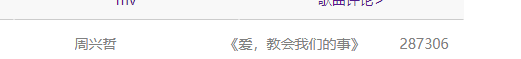

# Vue.js - day05

## Vue组件基本使用

[传送门](https://cn.vuejs.org/v2/guide/components.html)

> 把某个小界面或者说某个小功能，封装起来

### 基本使用

Vue.component

- 参数1：组件的id（id叫什么，到时候写标签就要写什么）
- 参数2：对象，对象里写组件的特征（data,methods,template），其中template写模板（组件包装的界面）

```js
Vue.component('hello',{
    template:'<div><h1>hello 渣渣37，毁人不倦，老子都病了！</h1></div>'
})
```


### 注意事项：

1. 模板里的html必须包含根标签（最外层要包一个标签）
2. 组件里的data不再是对象，而是一个函数，函数里再return一个对象，对象里写这个组件要访问的数据
3. 每个组件内部都是只影响自己的内容


### 方法和数据绑定

- 方法还是写methods
- 数据绑定还是data,但是data在组件里，是一个函数，函数内再return一个对象，对象里写数据


## Vue路由基本使用

[传送门](https://router.vuejs.org/zh/)

- 前端路由：可以用来控制不同的地址访问不同的内容
- 特点：看起来有点像tab栏
- 暂时把路由理解为：类似tab栏的功能：它可以不用跳转到别的页面，让内容发生改变

- 基本使用步骤：
  1. 准备组件
  2. 创建路由规则： 是一个数组，数组中每个元素是一个对象，对象里有`path`和`component`两个属性
     - 路径（path）和他对应的组件(component)
  3. 创建路由对象，并且用刚刚写的规则
  4. 实例化vue并挂载路由


## 编程式导航

[传送门](https://router.vuejs.org/zh/guide/essentials/navigation.html)

- 让你可以用代码进行路由的跳转

```
$router.push('路径')  //如果写在methods记得加this,如果写在行内不用加this的
```


## 动态路由匹配

https://router.vuejs.org/zh/guide/essentials/dynamic-matching.html

- 让你跳到对应的路由（对应的组件），还可以带参数过去


### 注意点：

- 编程式导航：用来跳转的路由
  - $router
- 拿传递过来的参数，用
  - $route
    - $route.params.参数名

## 过滤器

- 有的时候，有些数据没法直接拿来用，就需要对这些数据进行过滤，过滤器就是用来做这个功能的
- 使用

```js
fillters:{
    
    过滤器名字( value ){ //参数是被过滤的数据
        
        return 数据; //return的是什么，那么最终显示的就是什么
    }
}
```


## 生命周期钩子

- breforeCreate：  Vue实例（或组件）创建并初始化调用，但是此时data数据还没有挂载上来，所以在这里访问不到data数据
- created： 挨在breforeCreate的后面，但是在这个钩子触发的时候，data已经挂载上去了，就代表可以访问data数据
  - 最早能访问数据，应该在created
- beforeMount： 在DOM渲染之前调用
- mounted：DOM渲染完毕调用，这里能访问DOM元素了
  - 最早能访问DOM元素，应该在mounted
- beforeUpdate：数据发生改变，但是DOM还没变化之前调用
- updated： 数据发生改变，并且DOM已经变化了调用
  - 在这里可以设置滚动条滚动到最后
- beforeDestroy：销毁之前调用
- destroyed：销毁完成调用


## 路由高亮样式

[传送门](https://router.vuejs.org/zh/api/#active-class )


## Demo-歌曲搜索


### 实现步骤

1. 给文本框加双向绑定
2. 给按钮加点击事件，给文本框加键盘弹起事件只能由回车触发，他们两绑定的方法都一样
3. 事件里 拿到文本框的值 ，跳转到搜索结果的组件，并且把文本框的值传过去
4. 搜索结果的组件的 `created` 发请求（先拿到路由传递过来的歌名），拿到结果赋值给data里的数据（组件里的data是函数）
5. 渲染到模板里


## Demo-过滤器处理result中搜索的结果



### 实现步骤

1. 因为接口返回的时间是毫秒，我们不能直接显示，所以根据过滤器思想：不能直接用的数据要过滤，所以用过滤器
2. 过滤器里转成分:秒  
   1. 把毫秒 除以 1000 ，四舍五入取整 转成秒
   2. 秒 / 60 取整 得到分
   3. 秒 % 60 得到剩余的秒
3. 歌手名也要过滤
   1. 遍历数组，拼接到一个字符串里，以|分割
   2. 最后一个|要去掉


## 按条件显示MV图标

- 思路：看每个元素的mvid，如果不为0就显示，为0就不显示

## Demo - 点击播放图标跳转到播放组件

1. 准备一个播放组件
2. 添加到路由规则里，规则里需要传入一个id参数
3. 在搜索结果组件里给图标加点击事件，点击事件要接受当前的id，跳转到播放组件
4. 获取音乐url：https://autumnfish.cn/song/url?id=${id}
5. 获取音乐详情：https://autumnfish.cn/song/detail?ids=${id}

### 坑点！！！

>  记得给模板加id时不要跟别的id冲突，播放器模板不要叫player，叫其他的

## Demo-点击mv 播放MV

### 实现步骤


### 重点


## 预习

[脚手架](https://cli.vuejs.org/zh/guide/)

[安装](https://cli.vuejs.org/zh/guide/installation.html)

[创建项目](https://cli.vuejs.org/zh/guide/creating-a-project.html)