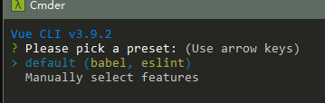
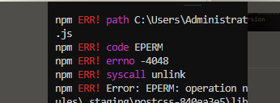

# Vue.js - day06

### 单文件组件

- 简单来说就是把组件单独放到一个文件里
- 在vue里面，我们这个文件的后缀叫 .vue
- .vue有默认的三大部分： `template`  `script`  `style`
- 如何生成三大部分？ sca + 回车  完整版:scaffold + 回车

## Vue-cli 安装

### 基本概念

1. `脚手架`
2. 把 `.vue` 翻译成浏览器可以识别的内容
3. 自动刷新浏览器
4. 自动压缩代码
5. 自动的把js翻译为低版本的js
6. 作为代理服务器(在本地开启一个小型的web服务器)
7. 方便帮我们管理我们导入的第三方包
8. ....

### 安装

[官网](https://cli.vuejs.org/zh/)

[安装](https://cli.vuejs.org/zh/guide/installation.html)

在小黑窗中输入`npm install -g @vue/cli`, 在任意的路径都可以

### 注意点

1. 
   1. 第一次安装，安装成功了
2. 
   1. 已经安装过，重新安装
3. 
   1. 类似于这样的一堆`err!`安装失败了
   2. 解决方案:
      1. 更换网络环境：有线，换无线，无线换4G
      2. 更换安装的工具
         1. `cnpm` ：`cnpm install -g @vue/cli`
         2. `yarn` :`yarn global add @vue/cli`
      3. 清除npm缓存之后，重新安装
         1. `npm cache clean -f`
         2. 重新执行安装的命令
4. 命令查看是否成功
   1. `vue --version`

## Vue-cli项目创建

[传送门](https://cli.vuejs.org/zh/guide/creating-a-project.html)


### 正常的流程

1. 创建之后会多一个项目文件夹，路径不要乱选
2. 项目名不要有中文，不要有大写字母，尽可能有意义

```
vue create 项目名
```

3. 弹出的对话框先选择默认的选项



4. 稍等一会，等进度条走完 提示如下画面说明成功了


5. 进入项目文件夹
   1. `cd 项目名` 直接根据提示即可 
6. 运行项目
   1. `npm run serve`
7. 稍等片刻 ，出现如下效果说明成功了


### 报错的原因

1. 

   创建的命令输入错误`create`输入成了`creat`

2. 

   1. 网络问题，有线换无线，无线换4G
   2. 终端的权限问题；新建管理员模式的终端
   3. 当前这个文件夹，这个文件被其他软件占用：关闭所有可能影响的软件（重启）
   4. npm包管理工具的问题:
      1. 用yarn来安装
      2. 执行``npm cache clean -f`` 在重新创建项目

3. 

   创建项目是，又到了第三方模块，文件太多了git人为没有必要管，提示你一下

   vue-cli创建项目是，已经设置了git忽略文件 就在`.gitignore`中


### 实在无法创建项目的解决方案（重要）

1. vue-cli创建项目的本质是：

   1. 创建文件夹
   2. 下载第三方模块
   3. 创建项目的基本结构
   4. 设置各个文件之间的关系
   5. 创建git仓库

2. 找一个可以创建项目的人，创建一个项目

   1. 删除`node_modules`

   2. 发给你

   3. 你使用`npm i `安装项目中用到的第三方模块

   4. `npm run serve`

      

## Vue-cli项目结构


- 脚手架创建完项目后，会自动把项目加入git托管功能

## Vue-cli项目编码位置

1. 组件的逻辑直接写在`xx.vue`

2. 目前写在App.vue 这个顶级组件里

3. 静态资源放到`assets`文件夹下面，直接使用对应路径即可引入

4. css``assets``也是这个文件夹，如何引入

   1. `style标签中引入`

   ```css
     /* 使用css支持的语法导入 */
     /* @import url('./assets/base.css'); */
   ```

   2. `main.js`中引入

   ```js
   // 导入 样式
   import './assets/base.css'
   ```

   

## Vue-cli src代码结构

1. main.js中
   1. 创建了最外层的Vue实例
   2. 把App.vue这个组件，当做Vue实例内部的最顶级组件并渲染出来
   3. 和public/index.html 中的那个id为`app`的div关联起来
2. App.vue 最顶级的那个组件，仅次于`Vue实例`
3. `assets`静态资源文件夹
4. `components`组件文件夹，除了`App.vue`之外的组件，都写到这个文件夹中即可

## 全局组件的注册

- 顾名思义：注册以后，所有地方都可以使用这个组件

- 用法：
  1. 来到 main.js
  2. 使用 `import 名字 from '组件路径'` 引入
  3. 调用`Vue.componment('组件id'，组件名字)` 来注册 （Vue的V是大写）
  4. 在需要用到这个组件地方，写 `组件id的标签` 就可以了

## 局部组件的注册

- 顾名思义：在哪注册，就在哪可以使用
- 用法：
  1. 在需要用的地方，引包  `import 名字 from '组件路径'` 引入`
  2. 在 `export default` 里写一个属性： `componments` 传入一个对象，对象里写 这个组件名
  3. 组件名叫什么，那么在html里就可以写这个名字的标签

## 组件的name属性

1. 直接在组件的内部写`name:值`即可
2. 不能用中文
3. 写了之后，chrome的vue插件中可以看到这个名字，更加利于检索，利于编码

## Vue-cli项目的路由整合

### 准备工作

1. 创建项目`vue create 项目名`
2. 进入项目文件夹`cd 项目名`
3. 运行项目`npm run serve`
4. 稍等片刻，通过提示的地址 在浏览器中 打开
5. 删除多余的组件`components/`内部的文件
6. 删除`app.vue`中的内容

### 整合路由

1. 下包 `npm i vue-router`
2. 导包 `import VueRouter from 'vue-router'` 
3. 用包
   1. 创建路由规则
      1. 创建一个组件`xxx.vue`
      2. routes=[ {path:"/xx",component:组件} ]
   2. 创建路由对象
      1. router
   3. 设置给Vue实例
      1. new Vue({ router })

#### 编码位置

1. 导入 注册路由 `main.js`
2. routerlink router-view `app.vue`
3. 添加组件`components/`
4. 静态资源`assets`

### 注意

1. 如果页面不够美观 可以找到对应的组件调整结构
2. 如果路由对应的组件不够美观，找到对应的组件调整结构

### Vue-cli项目整合player

1. 除了`node_modules`
2. 重新npm i下包 重新运行

### 实现 步骤

1. vue-router整合 `main.js`
   1. 下包 `npm i vue-router`
   2. 导包 `import VueRouter from'vue-router'`
   3. 用包 
      1. Vue.use(VueRouter )[出处](https://router.vuejs.org/zh/installation.html)
      2. 路由规则
         1. 创建对应的组件xxx.vue
      3. 创建路由对象 传入规则
      4. 路由对象设置给Vue实例
2. 设置导航栏和内容
   1. `App.vue`
3. 组件的位置
   1. `components/` xxx.vue


#### 整合导航区域

1. player中的index.html 结构拷贝到app.vue的结构中
2. 用到的`index.css`和`iconfont.css`拷贝到`assets`中，在`app.vue`导入


### 注意点

1. vue-cli开发项目文件的数量 多一些
2. `main.js`
   1. 路由
   2. 这个文件中可以访问到Vue实例
3. `app.vue`
   1. 页面中顶级的组件（最顶级的盒子）
4. `components/`
   1. 组件们`xxx.vue`
5. `assets/`
   1. 静态资源


## 总结

1. 单文件组件的组成

   1. 结构
   2. 逻辑
   3. 样式
2. vue-cli(脚手架)

   1. 把很多开发中需要用到的功能整合到了一起
   2. 让vue的开发人员直接专注于逻辑代码即可
   3. webpack配置出来的
3. 创建项目

   1. `vue created 项目名`

      1. 不能中文，不能大写
   2. 项目创建不好用别人创建好的，自己npm i
4. 运行项目
   1. 小黑窗进入项目文件夹
   2. `npm run serve`
5. vue-cli创建的项目
   1. 下包怎么下`npm i 模块名`
   2. 如何导包`import 名字 from '模块名'`
6. 整合路由
   1. 组件新建一个文件
   2. 路由的设置`main.js`
   3. App.vue router-link router-view
7. 项目运行
   1. `npm run serve`
   2. 根据小黑窗中提示的路径 ，在浏览器中打开即可

## 预习

1. 黑马买买买
   1. 静态资源写好了
   2. 接口也是现成
2. 抽取的逻辑
   1. es6的模块化语法
3. axios的一些高级设置
   1. 基地址
   2. 挂载到原型上