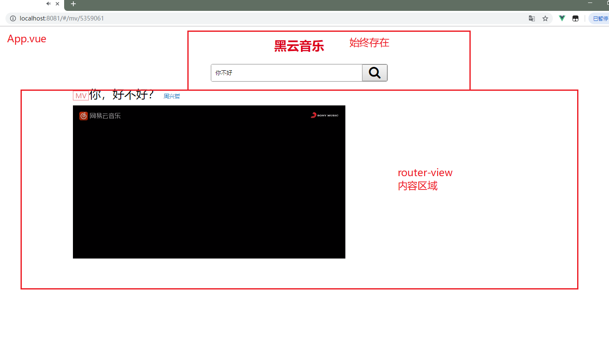
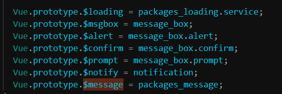
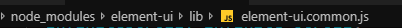

# Vue.js - day07


## player-项目创建

1. vue create 02.player
2. cd 02.player
3. npm run serve

## player-界面分析



## player-搜索区域整合

1. 准备 `search.vue`
2. 去模板复制结构
3. 来到 `app.vue` 注册search组件，在这里使用这个组件
4. 把css和img文件夹放到项目的 src里面的assets文件夹， 来到main.js，导入样式

## player-路由整合

1. 下载路由 npm i vue-router
2. 导入路由
3. 使用路由 `main.js`
   1. use一下
   2. 导入组件
   3. 注册路由规则
   4. 实例化路由对象
   5. 挂载给顶级的vue实例

### 注意

路由的整合套路是一样的，写多了自然就记住了

## player-轮播图

### 00 -整合轮播图组件

1. 创建轮播图组件 slider.vue
2. main.js中导入组件
   1. path:"/slider"
   2. component:slider

### 01 - 饿了么ui 介绍

1. 饿了吗前端团队开发的pc端的基于vue的组件库
2. 内部封装了很多现成的组件，直接就可以使用比如轮播图，tab栏，开关，table
3. 因为在vue开发时用的很多，所以和几个其他的库合并到一起被称之为 **vue全家桶**
   1. vue
   2. axios
   3. vue-router
   4. 饿了么ui
   5. vuex

### 02 - 轮播图组件使用 

 	1. 下包 npm i element-ui -S
		2. 导包 [传送门](https://element.eleme.cn/#/zh-CN/component/quickstart)
		3. 用组件
          		1. 找到你要的组件 找到你要的结构
          		2. c+v
          		3. 走马灯 组件
	4. 获取轮播图 <https://autumnfish.cn/banner> 
        	1. axios调用接口
       		1. 安装axios
       		2. 导入axios
       		3. created中接口调用
        	2. 数据回来之后
        	3. 渲染到页面上
	5. 可能还需要调整轮播图样式

#### 注意点

1. 复制来的代码，默认有个height属性为150，我们改成400
2. 给轮播图加个类，然后给这个类加样式 width：1080 并且居中
3. 记住：路由管理的组件要显示，还得去app.vue里加一个router-view


## player-歌曲搜索

### 01 - 搜索路由

1. 写组件 results.vue
2. 注册路由规则
   1. path:'/results/:name'
   2. component:results


### 02 - 搜索路由切换

2. 点击搜索
3. 按下回车时
4. 携带输入的内容 修改路由地址
5. `router.push('/results/搜索关键字')`
6. vue-router源码中的关键部分
7. 把$router设置给Vue的原型，所有的Vue实例就都可以使用这个属性了
8. 组件中编程式导航，this.$router.push('地址')

```js
  Object.defineProperty(Vue.prototype, '$router', {
    get: function get () { return this._routerRoot._router }
  });
```

### 03 - 饿了么ui 弹框

1. [传送门](https://element.eleme.cn/#/zh-CN/component/message)
2. 使用方式`  this.$message('这是一条消息提示'); `
3. 需要弹框的时候，调用上述的代码，即可弹出一个普通的消息提示框
4. 如果要弹出一些比较高级的框

```js
this.$message({
  message: '恭喜你，这是一条成功消息',
  type: 'success'
});
  this.$message({
  message: '警告哦，这是一条警告消息',
  type: 'warning'
});
  this.$message.error('错了哦，这是一条错误消息');
```


### 04 - 搜索结果非空判断

1. 01.search.vue
2. 点击搜索，或者是按下回车
3. 判断搜索关键字是否为空
4. 不为空跳转
5. 为空，提示用户
6. 使用饿了么的弹框，只需要在需要的使用调用方法即可
7. 

#### 注意点

1. $message之所以可以使用是因为设置给vue的原型
2. 在直接搜索`$message`即可找到

### 05 - 渲染搜索结果

1. 通过路由获取数据
2. axios调用接口 created  <https://autumnfish.cn/search?keywords=
3. 数据获取到之后
4. 渲染到页面上


#### 注意

1. created 很多时候都可以用来获取初始的数据 

### 06 - 过滤器歌手处理

filters:formatSinger(singers)\{ return}

### 07 - 过滤器时间处理

filters:formatTIme(time){ return}

 定义和用法类似，但是内部的逻辑需要根据需求来调整

### 08 - 侦听器（zhentingqi）

1. 检测指定的数据改变，执行自定义的逻辑
2. watch:{  数据名(){} }

#### 注意

1. watch的作用是，观察data中的数据改变，添加自定义的逻辑
2. 要观察那个数据，就写哪个数据的名字即可
3. 如果数据的访问涉及到点语法，使用引号包裹
4. updated，只要任何数据改变都会触发，watch只在**特定数据改变时**触发

### 09 - 重复搜索功能实现

1. 当search改变时重新调用接口
2. created中已经实现了接口调用
3. 抽取为函数，在2个地方调用即可

#### 注意

1. created组件如果不被销毁，只会触发一次
2. 如果有需求在特定数据改变时重新执行逻辑，可以使用 侦听器`watch`
3. watch和updated相比触发的频率 低


## 把axios设置为全局

1. 来到`main.js` 导入axios
2. 再把axios设置给Vue的原型对象

```js
Vue.prototype.$axios = axios;  //这样做了以后在其他Vue文件里，通过this.$axios就可以访问了
```

### 注意：为什么要加$符号？

- 这是规范
- 为什么有这个规范？
  - 为了区分这个属性是自己的还是原型里继承来的

## player - 播放歌曲

### 01 - 点击去播放器界面

1. 先准备一个播放器页面的组件
2. 把它用路由管理起来
   1. 记得，这个路由的规则的path上，要加参数（‘/:id'）
3. 回到`搜索列表` 界面，给播放图标加点击事件
   1. 传递被点击的歌曲id
   2. 跳转到播放界面 

### 03 - 歌曲信息显示

1. 在created（因为要越早越好），拿到传递过来的id，发请求获取歌曲详情

   `/song/detail?ids=347230`

2. 再发一个请求获取歌曲的url

   `/song/url?id=33894312`

3. 再发一个请求去获取歌词

   `/lyric?id=33894312`

4. 把三次请求获取到的数据，保存到data

5. 渲染到界面

### 设置axios基地址

- 因为我们现在这个案例中访问的接口其实网址都是一样
- 其实后面真是项目一般访问的接口，前面网址都是一样的，只是后面的路径部分不一样
- 但是现在我们现在必须每次都要把前面的网址写完
- 有没有一个方法是让axios发请求时只要写路径部分，它自动帮我拼前面的网址部分
- 这个就是基地址

```js
axios.defaults.baseURL = 'https://autumnfish.cn/'
```

- 特点：如果你发请求没写网址前缀，它会自动帮你加上，但是你如果你写了就不加了

### 05 - 歌词显示

处理歌词用的正则`/\[\d{2}\:\d{2}\.\d{2,3}\]/, `

上面的 3 4 5步骤类似

created中 调用 歌曲url接口，歌曲封面接口，及 歌词接口即可


## player - mv播放

1. 准备mv组件

2. 要被路由管理

    把mv的id传过来

3. 回到 `results` 页面，给mv的图标加点击事件，要传入mvid

4. 跳转到mv界面

5. 在created拿到mvid，发请求，获取mv的地址，然后赋值给video的src

   `/mv/detail?mvid=5436712`

### 注意点：

1. 歌手名要循环拼接
2. 视频我们优先选高清的，所以要比大小（擂台思想），但记得不能用fori，因为它没有length属性，只能用for in遍历

## player - 歌曲评论

### 01 - 歌曲评论路由设置

### 02-点击携带歌曲id去评论组件

### 03 - 获取评论信息

### 04 - 格式化评论时间

使用moment.js


## 总结

1. 饿了么ui，饿了么开发的基于vue的组件库
2. 路由重定向 redirect
   1. 地址1 跳转到地址2
3. axios抽取到原型上
   1. Vue.prototype.$axios = axios
   2. axios.defaults.baseURL
   3. $是一个建议
4. 侦听器,watch 
   1. 特定的数据改变，会触发的回调函数（钩子）
   2. 和methods,fillters
5. 饿了么ui的走马灯-轮播图


## 补充

低成本，电脑加速

 	1. 加内存
		2. 加固态


