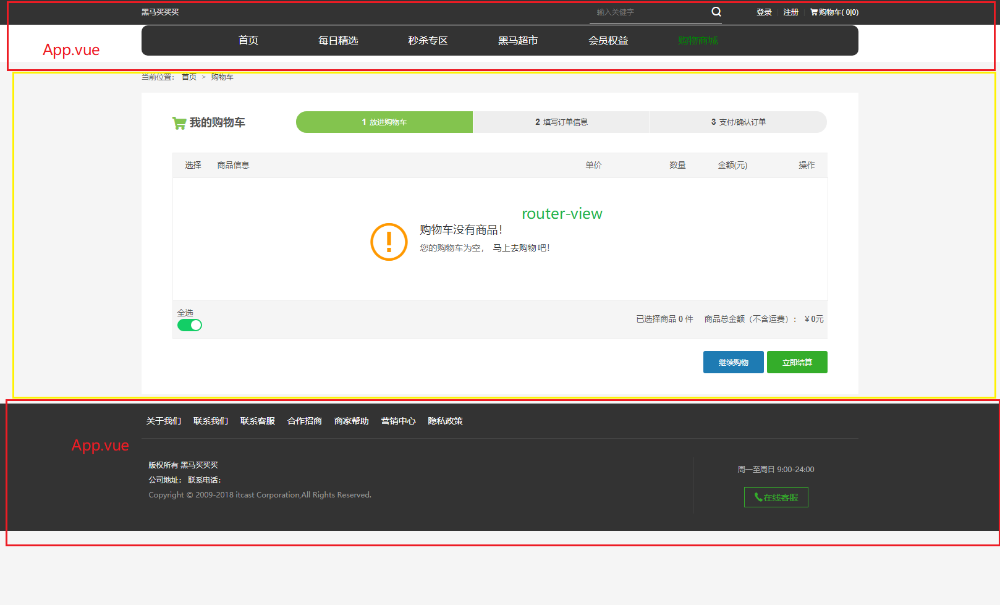
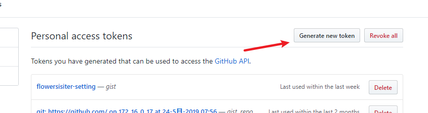

# 	Vue.js - day08


## 路由重定向

- 在设置路由规则的地方，加一条规则

```js
{ path: '/a', redirect: '/b' }  //从a重定向到b
{ path: '', redirect: '/slider' }  //后缀毛不不输入，跳转到slider，换一句话说是相当于把slider作为首页
```


## player - MV播放

### 01 - 准备MV组件和设置路由

- 在components里新建一个文件叫mv.vue
- 路由里设置它的规则  `/mv/:mvid` 访问，要参数
- 在`result`页面给 mv 的图标加点击事件，传mvid，用编程式导航跳转


## player - 歌曲评论

### 01 - 歌曲评论路由设置

1. main.js 路由规则
   1. comment.vue
   2. path:/comment/:id
   3. component:comment

### 02-点击携带歌曲id去评论组件

1. 在 04.player.vue组件中
2. 为歌名 绑定点击或者双击事件(dblclick)
3. 编程式导航`this.$router.push('/comment/${id}')`

#### 注意点

1. 根据需求找到设置的文件即可

### 03 - 获取评论信息

1. created获取评论信息 /comment/hot?id=186016&type=0 
2. then方法中
3. data中加数据
4. 页面中写vue指令 渲染

### 04 - 格式化评论时间

1. 下载moment.js  

   1. npm i moment

2. 05.comment.vue中添加一个过滤器

   1. filters:{  formatTime(time){ 处理并返回 } }

3. {{ 数据 |过滤器}}

4. 时间的处理，第一时间想到moment这个库

## 播放器优化

### 统一设置宽度

App.vue中

给router-view加个类

给这个类加样式即可

### 设置滚动

1. iScroll很流行的滚动库，已经不更新了
2. better-scroll [更好的滚动库](https://www.npmjs.com/package/better-scroll)
   1. 下包 npm i better-scroll 
   2. 导包
   3. 准备结构
   4. 用包

#### 注意

1. 获取dom元素最早在mounted中
2. 更美观的滚动效果，工作中偶尔会碰到
   1. iScroll
   2. better-scroll(推荐)
   3. 单纯的滚动库
3. 为了实现滚动效果，
   1. 3层盒子
      1. 容器
      2. 内容容器
      3. 内容
   2. 容器的高度必须写死，内容超过了容器之后，自动滚动

### 接口缓存问题

1. [传送门](https://binaryify.github.io/NeteaseCloudMusicApi/#/?id=%E8%B0%83%E7%94%A8%E5%89%8D%E9%A1%BB%E7%9F%A5)
2. 以后发ajax请求，都有可能遇到缓存问题
3. 解决办法：在接口后多加一个参数： `timestamp=时间戳`
4. Date.now() 获取的是从 1970-1-1 0:00 到当前的总秒数，这就是时间戳

```
// 接口本来不需要参数 额外的增加时间戳参数
https://autumnfish.cn/banner?timestamp=${Date.now()}
// 接口本来需要参数 增加时间戳
https://autumnfish.cn/search?keywords=key&timestamp=${Date.now()}
```

5. 不要用这个时间戳去请求某云音乐太多次，它会把我们的接口的封掉

## watch补充

### watch的2个参数

1. 参数不写，直接通过 this.数据的方式 也可以获取到最新的数据

```js
// 侦听器
    watch: {
      // 和数据的名字一样
      // 参数1 新值
      // 参数2 旧值 上一次的值
      // 参数不写，直接通过 this.数据的方式 也可以获取到最新的数据
      // 需要新旧对比时 可以用到第二个参数
      message(newValue, oldValue) {
        console.log(newValue)
        console.log(oldValue)
        // 尝试访问data中的数据
        console.log(this.message)
      }
    }
```

### 深度侦听

- 默认情况下，侦听一个对象，但我们改变的是这个对象里的属性值，不会触发侦听
- 要想让对象里的属性只要改变都触发，就要用深度侦听
- 用法：
  - 在watch里些对象名，直接给的值也是对象 
  - 对象里有2个，一个叫 handler（函数）  一个叫 deep:true

```js
 // 侦听复杂类型数据的时候，传入的参数，是数据的内存地址
      // 2个参数的值是一样的
      // 基本数据类型2个参数是不同的
      // 复杂类型无法通过2个参数进行对比
      food: {
        handler(newVal, oldVal) {
          console.log(newVal)
          console.log(oldVal)
        },
        // 开启深度侦听
        deep: true
      }
```

1. 4. 
      2. 开启深度侦听之后，2个参数给我的值都相同，我本来还想作比较的
   5. 侦听的时候，精确到对象的属性名就可以避免这个问题了！
   6. 其实在数据改变时，用updated这个钩子也可以，但是触发的频率比侦听器高
   7. 除了updated钩子，我还用过这些钩子，比如
      1. mounted
      2. created
         1. axios数据获取
         2. 抽取axios
2. **建议用自己的语言重新组织这部分内容**

- 注意：新参数和旧参数，是一样的，因为你侦听的是对象，你改的只是属性值，对象的地址没变过，所以是一样的


### 面试问题

工作中有没有遇到过什么bug（问题），你又是怎么解决的？

- 我之前写vue项目的时候用了侦听器，为了侦听一个对象的改变，我用了深度侦听
- 但是我又想比较两次数据的异同，结果发现侦听器两个传递过来的参数居然一毛一样
- 当时百思不得其解，然后因为项目赶，想了想我就没用深度侦听，而是直接改成普通侦听，具体侦听对象里的哪个属性，这样的话就能比较异同了
- 后面项目做完了，我想起这个问题，去查了一些资料，才发现原来因为我侦听的是对象，而我改的只是属性值，那么侦听对象，对象的两次值没变（就是它的地址没变），仅仅变得只是属性值，所以才会新值和旧值一样，就此后觉得自己对于基础的细节掌握的不够深和细致，所以后面又多去看博客和书籍来补充了一下这方面的知识，比如说我就看了一本书叫《你不知道的JavaScript》里面好多细节，补充了我这方面的知识盲点


## 过滤器补充

[过滤器中的this](https://github.com/vuejs/vue/issues/5998)

### 过滤器的串联

1. 依次写一堆过滤器即可

2. ` <h2>{{ info | addFont | addBack | addBack2 }}</h2> `

   ```js
   filters: {
         addFont(value) {
           return '唱,' + value
         },
         addBack(value) {
           return value + ',rap'
         },
         addBack2(value) {
           return value + ',打篮球'
         }
       }
   ```

### 过滤器传参

1. 调用过滤器是，和调用方法类似，传入参数即可

```html
<h2>过滤器的传参</h2>
<p>{{ food | cookFood('爆炒')}}</p>
<p>{{ food | cookFood('清蒸')}}</p>
<p>{{ food | cookFoodPlus('清蒸','红烧')}}</p>
```

2. 定义过滤器时

```js
// 处理food的过滤器
  cookFood(foodName, do1) {
    return foodName + do1
  },
  // 高级烹饪
  cookFoodPlus(foodName, do1, do2) {
    return foodName + do1 + do2
  }
```

3. 自己传入的参数，从第二个开始，第一个参数固定是，处理的数据

### 全局过滤器，局部过滤器

1. 定义一次

   1. 所有地方都可以用
   2. 语法如下：参数1：过滤器名字，参数2：回调函数
   
```js
    Vue.filter(过滤器名字, (value)=>{
       return value+'削皮，切碎，爆炒，油炸，装盘，美滋滋！！！'
     })
   ```
   
3. 局部过滤器

   1. 定义一次，只在当前这个Vue实例中可以使用（组件）
   2. 实例内部的`filters` 局部过滤器

## 黑马买买买

### 项目准备

1. 创建项目
   1. vue create 03.blackbbb
   2. cd 03.blackbbb
   3. npm run serve
2. 整合静态资源
   1. assets文件夹
3. 删除多余的部分
   1. helloWorld
   2. App.vue中的内容

### 路由整合



1. 装路由
2. main.js
   1. 导入
   2. use
   3. 规则
   4. 路由对象
   5. 挂在到Vue实例上
3. 写组件 01.index.vue
4. App.vue
   1. 头部
   2. router-view(tab-content)
   3. 底部
5. 导入样式
   1. main.js中导入样式
6. 静态资源必须放在`assets`中

### 首页重定向

1. main.js
   1. path:"/"
   2. redirect:'/index'
2. 一般希望用户默认去的地址，如果不是`/` 可以使用 重定向 

### axios抽取和基地址设置

1. main.js
   1. 下包  npm i axios
   2. 导包
   3. axios.defaults.baseURL ='地址'
   4. Vue.prototype.$axios = axios
2. 所有的组件中，this.$axios 


#### 面试题

1. 原型用过吗？axios相关的问题？

   1. 为了共享，设置到Vue原型上

   2. 所有的组件都是Vue的实例 所以this.$axios可以共享

   3. $axios的命名依据 区分自己和原型上的属性

   4. 查看vue-router的源码，或者是饿了么ui的源码发现共享的都是这么设置的

      1. 路由原理

      2. 饿了么ui的原理

      3. ```
           Object.defineProperty(Vue.prototype, '$router', {
             get: function get () { return this._routerRoot._router }
           });
         ```

      4. 在路由的源代码中看到了 Object.defineProperty方法，这个方法就是Vue数据响应式原理的方法

      5. 解释数据响应式原理

      6. vue3.0要出了，3.0中用了一个新的技术`proxy`

### 首页顶部数据获取

1. created中 调用 site/goods/gettopdata/goods
2. .then中获取数据
   1. data中声明
   2. 页面中挖坑，填充

### 首页右侧数据处理

1. 为了全部都可以使用，全局过滤器 main.js
2. 格式化时间，moment
3. 处理的格式不确定，希望你传给我 ，过滤器的传参


```js
// 全局过滤器  2->two 很多时候用2去代表to
import moment from 'moment'
Vue.filter('formatTime', (value, how2Format) => {
  // 处理并返回时间
  return moment(value).format(how2Format)
})
```

####  注意

1. 过滤器多个地方要使用，使用 全局过滤器定义在`main.js`
2. 如果有部分内容无法确认，用过滤器的传参来实现
3. 比如这里就使用过滤器的传参，让用户把 `格式`传过来

### 详情页跳转

1. main.js
   1. 写02.detail.vue
   2. path:/detail/:id
   3. component:detail
2. 点击首页的 顶部 右侧区域 
   1. 点击事件 传入id
3. 去详情页 携带商品id
   1. this.$router.push('')
4. 接口地址 `site/goods/getgoodsinfo/87 `

### 详情页顶部数据渲染

1. created中
2. then
   1. data中写数据
   2. 页面中挖坑 填坑


### 详情页右侧数据处理

1. 使用全局过滤器处理
2. 方便重复使用

### 详情页详情数据渲染


## 总结

1. 过滤器补充
   1. 串联 {{va|过滤器1|过滤器2}}
   2. 过滤器的传参   {{va|过滤器1('参数')|过滤器2}}
      1. 自定义的参数从第二个开始
   3. 全局过滤器
      1. main.js中写
      2. new Vue之前写
      3. 所有的组件都可以用
2. watch
   1. deep:true
   2. 复杂类型的2个参数，一样
   3. 基本类型的2个参数，不一样
   4. 如果要检测复杂类型的某个字段，建议 `数据.属性.属性`
3. player
   1. 滚动
   2. iScroll
   3. better-scroll(推荐)
4. 黑买
   1. 全局过滤器的实际应用
   2. axios的抽取
   3. 路由抽取


## 补充

### VSCode同步插件-配置上传


1. ctrl+shift+p 输入sync 选择上传配置
2. 自动跳转到github 新建一个gist




3. 把上面生成的那个值 c+v到vscode的弹框中 回车


4. 看到如下提示说明上传成功


5. 只要你知道别人的这个key 谁的都可以下载


